#  基础设置：

1、返回次数设置：

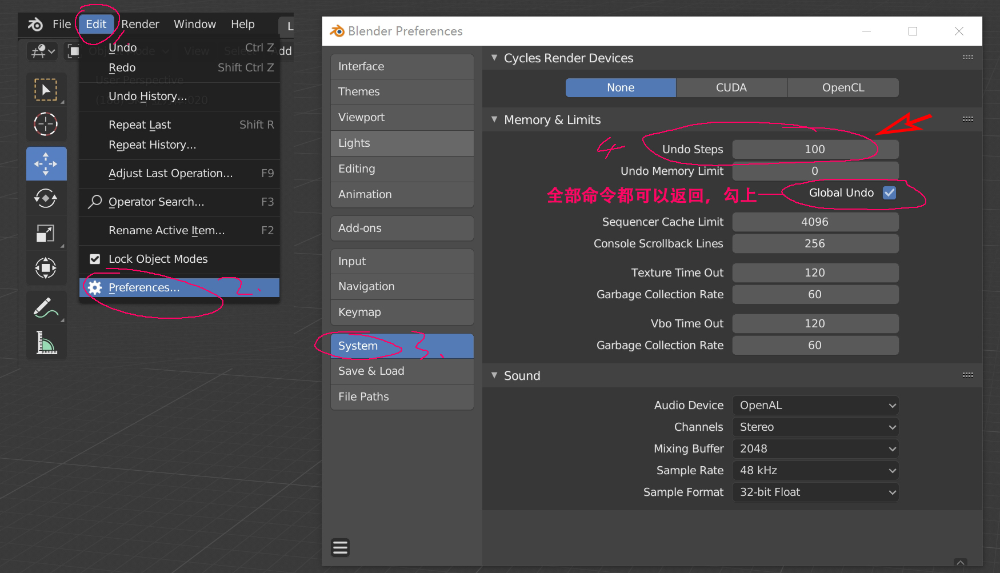 

返回次数设置

2、中文设置：

  

中文设置

3、删除材质球：在层级视图——▶Blender文件里删除

 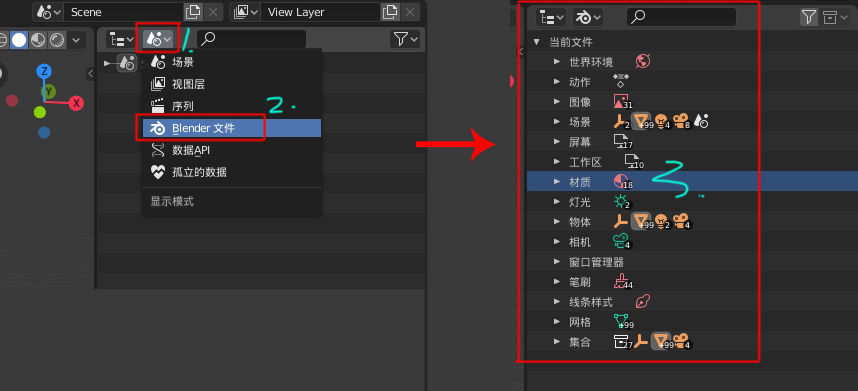 

删除材质球

▶Ctrl+N：创建新工程

▶ 微调：滑动数值、缩放等等操作都可以按Shift进行微调

▶ Tab：编辑模式与物体模式/其他模式切换

# **视图操作**

**🌛1、放大视图**

▶ 视图最大化显示：Ctrl+空格（左键点击视图任意地方可以选择视图，然后按Ctrl+空格可以最大化显示视图。）

▶ 切换全屏模式：Ctrl+Alt+空格

**🌛2、切换视图**

▶ 视图切换菜单：【~】（ESC键下面）

​                              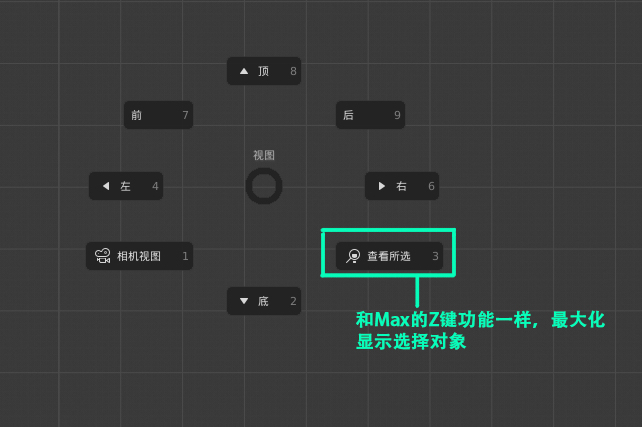 

▶ 切换视图：Alt（按住不放）+按住中键上下或左右移动鼠标（每切换一次视图就必须重新按一下中键并移动鼠标）

▶ 透视图：中键+随意移动鼠标

▶ 顶视图：数字键盘【7】

▶ 底视图：数字键盘【Ctrl+7】

▶ 前视图：数字键盘【1】

▶ 后视图：数字键盘【Ctrl+1】

▶ 右视图：数字键盘【3】

▶ 左视图：数字键盘【Ctrl+3】

▶ 摄像机视图：数字键盘【0】

▶ 正交视图/透视图： 数字键盘【5】

▶ 透视图/四视图：Ctrl+Alt+Q

**▶ 反转视图： 数字键盘【9】，比如前后反转/上下反转/左右反转。
**

**🌛3、旋转视图**

▶ 上下旋转视图： 数字键盘【8】

▶ 下上旋转视图： 数字键盘【2】

▶ 右左旋转视图： 数字键盘【6】

**🌛4、视图操作**

▶ 移动：Shift+中键

▶ 旋转：中键

▶ 缩放：Ctrl+上下（或左右）移动中键

**🌛4、视窗互交**

▶ 视窗互交：把指针放到视窗右下角，按住Ctrl+左键不放，出现+号时，拖动到其他视窗，可以互换。

# **显示/隐藏**

**▶ 空格键： 显示隐藏操纵杆
**

​                                                     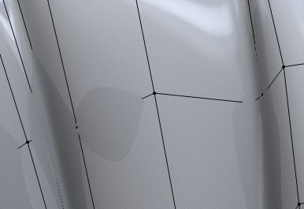 

显示隐藏操纵杆

**▶ H：隐藏选中项
**

**▶** Shift+H：**隐藏未中项**

**▶ Alt+** H：显示**隐藏对象**

▶ Home：全局显示（可以查看场景全部对象）

▶ 数字键盘【/】：单独放大显示选择的对象（其他物件会被隐藏），这时候Home键不起作用，要再按一次【/】返回之前的状态，就可以把隐藏的物件显示出来（这时候Home键就可以用了）。

▶ 数字键盘【.】：居中放大显示选择的对象

▶ N： 显示Properties（属性）栏【查看对象属性】

​                                               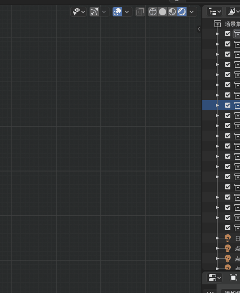 

**▶ 生成关联项菜单：**Ctrl+L（作用：比如把一个模型用到的修改器复制到其他模型上面：操作方法，选择所有需要复制修改器的模型，最后加选/**最后选择**使用修改器的模型，然后按Ctrl+L打开**生成关联项菜单**，选择**修改器。**之后想调节数值时，**按住Alt**，调节的数值会关联到被复制修改器的模型上面。）

​																				 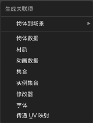 

生成关联项菜单

▶ Apply应用菜单：Ctrl+A 把对象变换参数重置归零。

 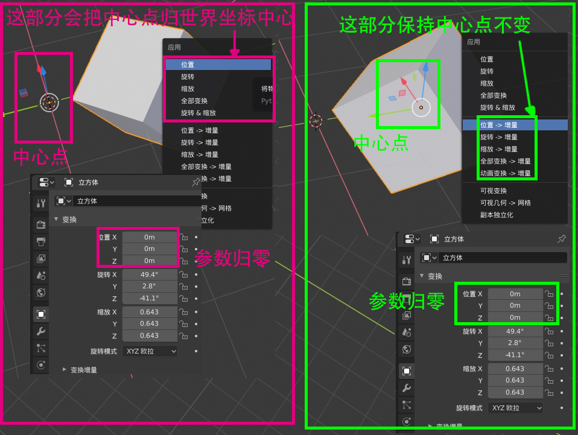 

 Apply应用菜单

 ▶ 重置模型（相当于3D Max里的重置模型命令）：Ctrl+A 打开Apply应用菜单，选择“全部变换”。缩放拉伸模型后再布线、倒角就会有问题，这时候就需要重置模型了。

​                                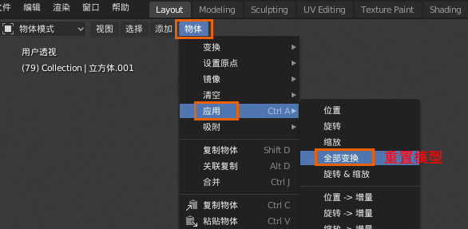 

重置模型

▶ **半透明显示**：**Alt+Z（可以选择到背面）**

▶ 线框显示：Shift+Z **（可以选择到背面）**

## ▶ 线框显示：

​                                   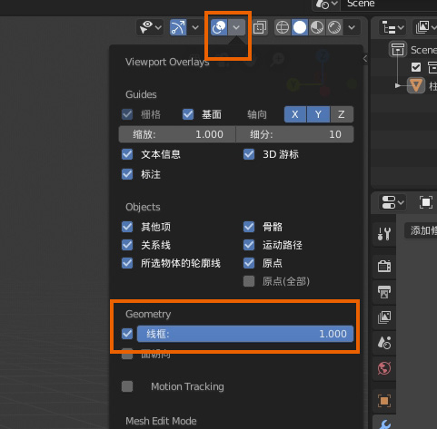 

线框显示

▶ Z：显示模式选择【按住Z的同时快速滑动鼠标到想要的模式，就可以快速切换显示模式】

  

显示模式选择

▶ T：显示工具菜单

​                                                                         

显示工具菜单

**▶ Shift+空格：打开工具菜单**

​                               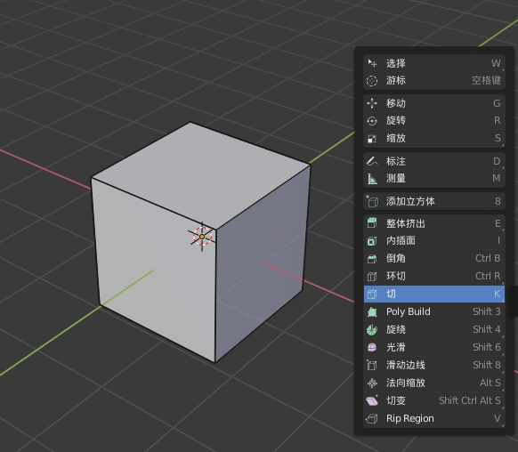                

打开工具菜单

▶ 显示法线方向：编辑模式下

 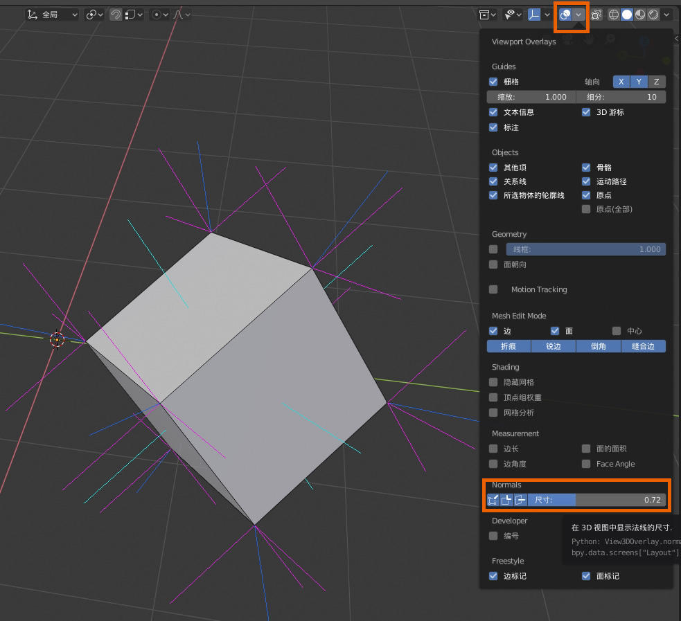 

显示法线方向

▶ AO效果显示：

 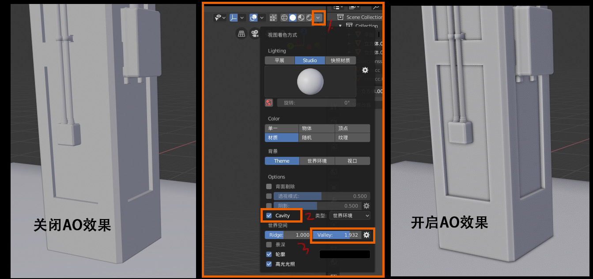 

 AO效果显示

# **游标**

**▶ Shift+S：游标操作菜单**

 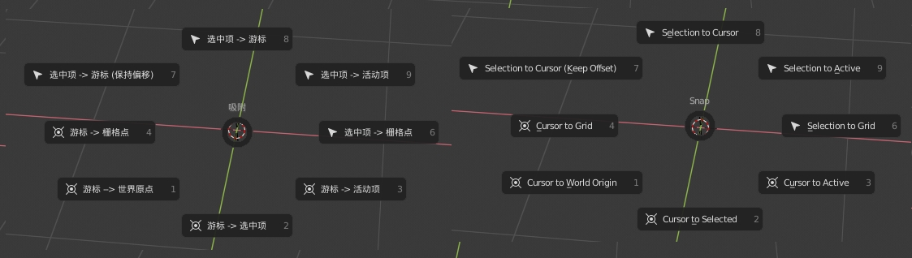 

游标操作菜单

▶ Shift+右键：可以随意放置游标

▶ Shift+C：重置游标到世界坐标中心

▶ 以游标为中心操作视图：按N打开Properties（属性）栏，在视图选项里勾选【锁定到3D游标】，然后就可以以游标为中心操作视图了。

# 坐标  

更改坐标系：

​                                                          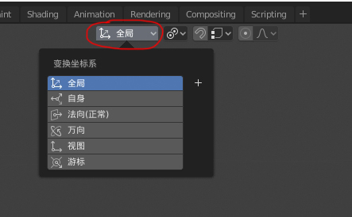 

坐标系

▶ ALT+G：对象归零到世界坐标中心

▶ ALT+R：旋转归零

▶ ALT+S：缩放归零

# **建模**

▶ 撤销（返回）：Ctrl+Z

▶ Shift+A：创建菜单（可以创建对象）

▶ 移动：G/或者选择移动工具 【操作方法1、按G后可以随意移动物体； 2、按G后再按X/Y/Z，或者按G后再按中键，可以在X/Y/Z三个坐标轴上移动。】

**▶ 使点、边在线上滑动：按两次G；再按Ctrl可以等比例移动；不动鼠标，按上下键可以精确移动**

▶ 缩放：S/或者选择缩放工具

▶ 旋转：R/或者选择旋转工具

▶ Ctrl+Tab：切换到编辑、物体、雕刻、纹理绘制、顶点绘制、权重绘制等模式

▶Tab：编辑模式/物体模式切换

### ▶ 复制：Shift+D

▶ 关联复制：Alt+D

▶ 原地复制：Ctrl+C 然后再按Ctrl+V可以原地复制了

▶ 镜像：按Ctrl+M之后，再按X/Y/Z

▶ 游标选项：Shift+S

▶ 多边形建模：点级别下Ctrl+右键（提前得有一个点，选择这个点后，按Ctrl+右键，可以自由产生线，然后按F补面，可以与挤出结合使用）

▶ 细分级别：Ctrl+1~5（物体模式下）

▶ W：框选、套索、圈选工具切换

▶ Ctrl+M：镜像（反向翻转），按Ctrl+M后需要选择翻转轴向。

▶ 点、线、面级别：1、2、3

▶ 点、线、面菜单：Ctrl+V、Ctrl+E、Ctrl+F

▶ 挤出：E、Ctrl+右键 (前提：在选择点、先、面的情况下)

▶ 沿法线方向挤出/挤出各个面（独立挤出）：Alt+E

▶ Spin旋转复制/挤出工具：（只能在编辑模式下使用）

 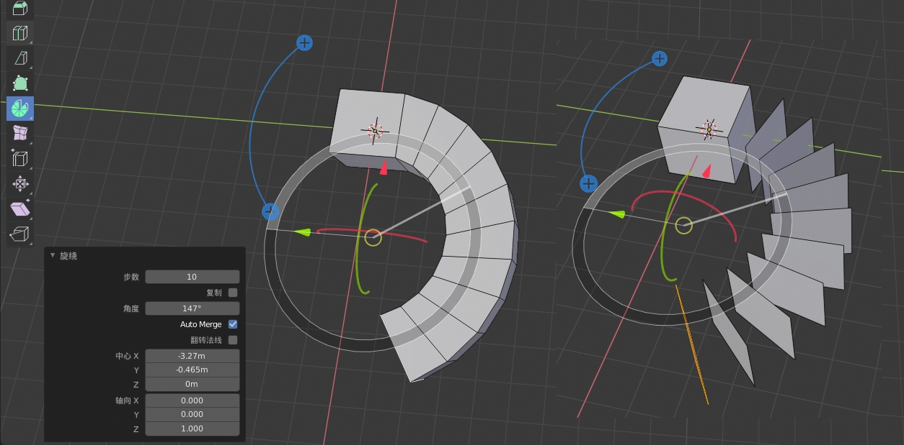 

 ▶ 塌陷：ALT+M

​                                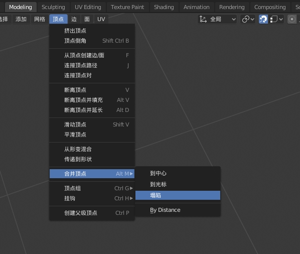 

塌陷

#### ▶ 合并模型：Ctrl+J (把两个模型合并成一个模型)  

####  **▶分离模型：** P

▶ 合并顶点：按ALT+M选择By Distance

​              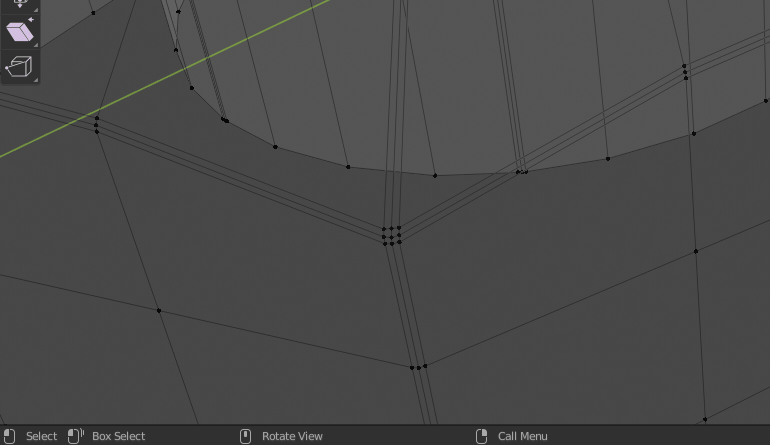 

合并顶点

▶ 自动合并顶点（把一个点拖到另一个点，并使两个点自动变成一个点）：按N打开工具菜单

 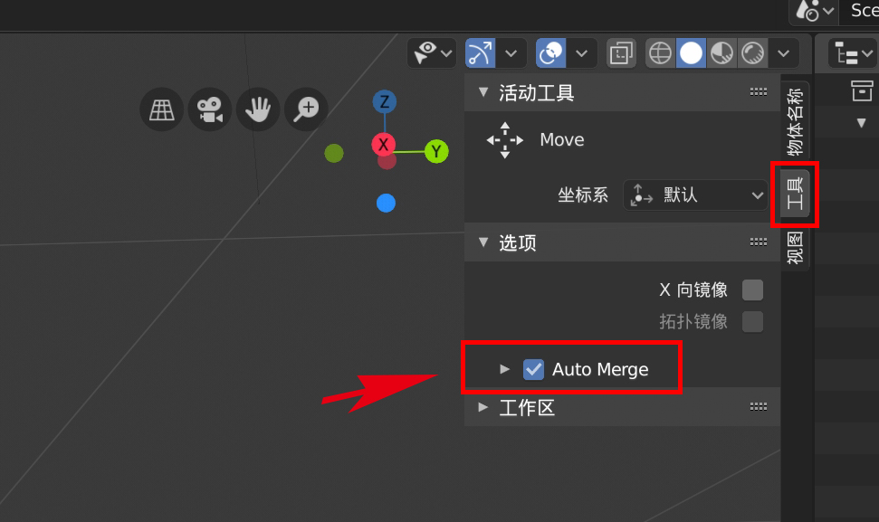 

自动合并顶点

▶ 删除：X 【可以选择删除对象/点/线/面】。再物体模式下可以按Delete删除。

▶ 提取点线面：Shift+D

▶ V：切割分离工具（按V后 移动鼠标拉开模型）

 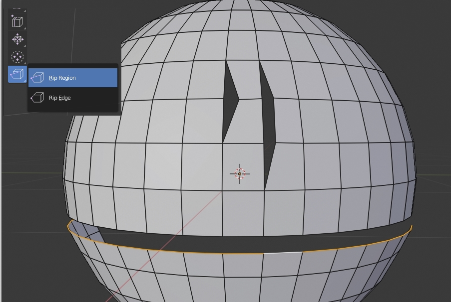 

切割分离工具

▶ 环形切线：Ctrl+R 【1、按Ctrl+R后，点左键再点右键确认切线在线的中间位置；2、点左键后，可以移动切线位置，再点左键确认切线；3、按Ctrl+R后，滑动鼠标滚轮可以增加和减少线段（线条变黄色的时候可以增加分段，变橘黄色就不可以了），或者直接按数字】

▶ 自由切线：K （1、切线过程中按Ctrl不放可以捕捉到线的中间点；2、Shift不放可以取消吸附；3、切线完后按E可以重新加切线；4、按Enter确认切线）

▶ 劈线：K （1、劈线过程中按Z可忽略背面；2、按C可以平行/垂直/45度角劈线）

 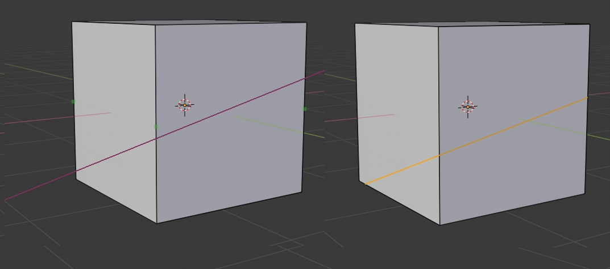 

劈线

▶ 切分模型：看下图

 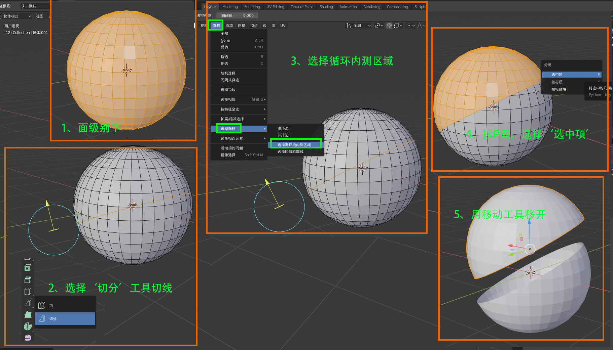 

切分模型

▶ 连线：J（两点之间连接一条线）

▶ 倒角：Ctrl+B：按Ctrl+B后，左右/上下移动鼠标调节倒角大小，按住Shift可以微调；滑动鼠标滚轮可以添加分段

▶ 顶点倒角：Ctrl+shift+B

▶ 插入面：i （在选择面的情况下）

▶ F：【补洞/填充】：1、可以智能填充，选择边界边或一条边后按F；2、桥接：选择三个以上的顶点或者两条以上的边后按F。

 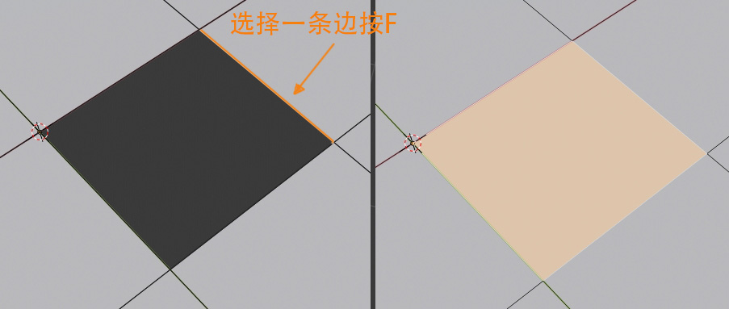 

补洞/填充

▶ Poly Build：（拓补常用）

 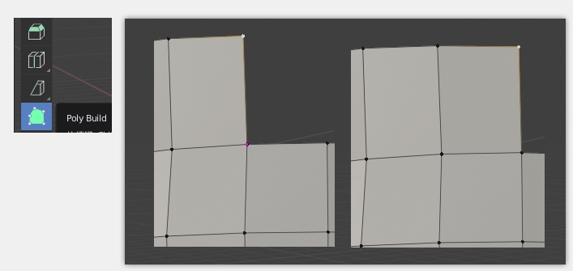 

Poly Build

▶ 弯绕工具：shift+W

▶ ALT+S：使元素（点线面）沿法线方向收缩（移动）

▶ 沿着线移动点线面（编辑模式下）：快速按两次G

**▶ 吸附：**按G移动的时候，按 Ctrl不放可以临时打开吸附功能

▶ 球形化工具：选择工具后按住左键不放并移动鼠标

  

# 层级视图

 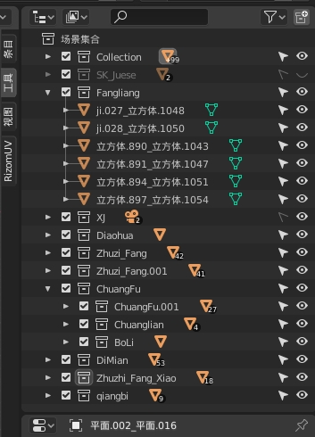 

层级视图

**▶给模型分组：M**

 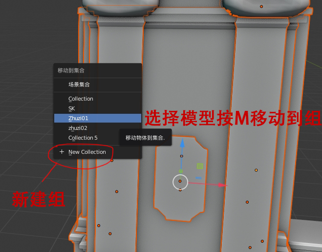 

**▶快速在层级里找到目标模型：数字键盘（ . ），操作：选择模型后点层级视图激活视图，然后按数字键盘（ . ），就能在层级里找到目标模型。
**

#  **选择**  

▶ 背面选择开关：ALT+Z

▶ 加选：Shift+左键

▶ 减选:Ctrl+左键

▶ 套索加选：Ctrl+右键

▶ 套索减选：Ctrl+Shift+右键

▶ 扩展/缩减选择：Ctrl+数字键盘【+】/【-】

#### ▶ 点/线/面之间转换：选择点/线/面后，再按1/2/3可以再点/线/面之间相互转换  

▶ 选择全部元素（点线面）：Ctrl+L

▶Loop（循环）选择：ALT+左键 （1。循环选择点、线：ALT+左键都选择线就可以了）；（2。循环选择面：这里有个前提，即必须有一个方向才能循环选择。比如：我要左右环形选择一圈面，这时候要把鼠标指针放到面的靠左边部分或靠右边部分，不能放在面的中间。）

▶Ring（环形）选择：Ctrl+ALT+左键 （这里用于环形线的选择，面也可以）

▶ 快速选择整个模型：在选择点、线、面之后按 Ctrl+L 【选择整个模型后还有一个操作： Ctrl+右键 可以复制当前选择的模型】

▶ 全部选择：A （1、左键点空白处取消选择，或者按两次A取消选择；2、按下图设置之后按A选择，再按一次A取消选择）

 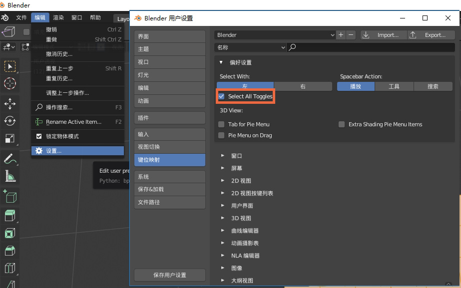 

A键选择设置

▶ 方形框选：B

▶ 画笔加选：C (缩放笔刷：中键。取消笔刷：右键）

▶反向选择：Ctrl+I

▶ 软选择：

 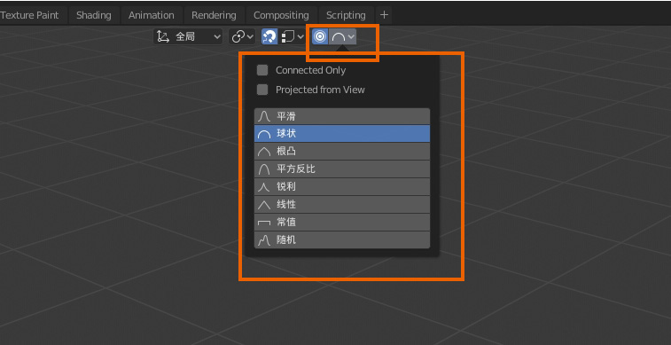 

软选择

# 光滑组与法线

▶ 面级别下 Ctrl+F或者右键打开菜单： 1.平滑着色（软面）。2.平直着色（硬面）。

详细设置看下图。（有时候勾选“自动光滑”好像不起作用，这时候在模型上重新右键给光滑组后，在点“自动光滑”才起作用。）

 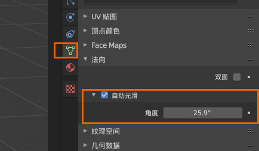 

光滑组设置

▶ **把软边转为硬边**：选择边后，按Ctrl+E或者右键打开边菜单，选择**“标记为锐边”**

▶ 向外重置法线：Shift+N（编辑模式下）

▶ 向内重置法线：Ctrl+Shift+N

▶ 反转法线：ALT+N

 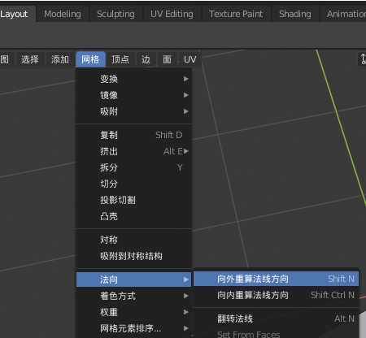 

重置法线

# 曲线  

有时候想删掉曲线会把模型也删掉，这时候需要重置下模型在删除曲线。

▶ 关闭曲线的法线方向显示：

  

关闭法线方向显示

▶ V：控制柄控制类型

 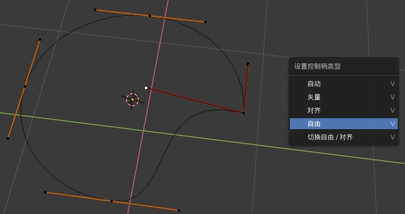 

控制柄控制类型

▶ E：挤出

▶ Shift+N：重新计算（重新计算控制柄的方向）

▶ 加点：选择两个相邻的点右键选择【细分】

 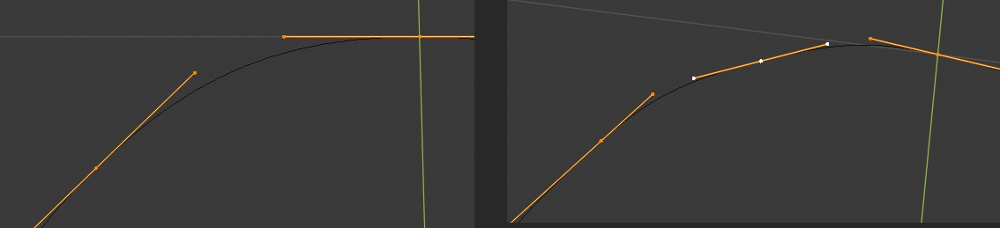 

加点

▶ P：分离

▶ F：缝合（首尾相连），使两个点相连

 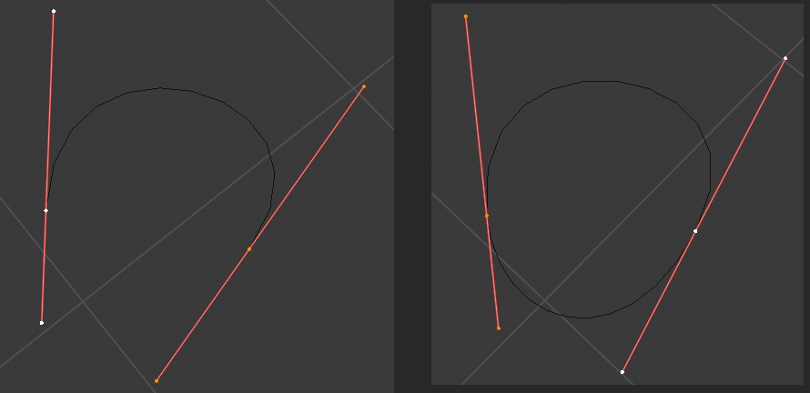 

缝合

▶ Ctrl+T：倾斜扭曲/Alt+T：恢复倾斜扭曲（必须在3D模式下才能用）

 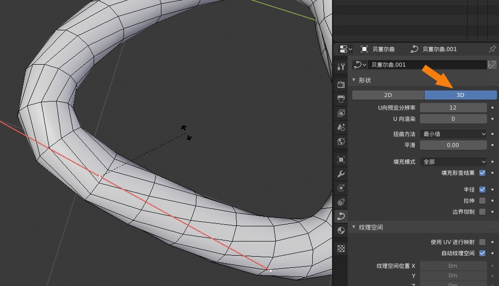 

倾斜扭曲

▶ Alt+S：缩放（可以对点进行缩放）

 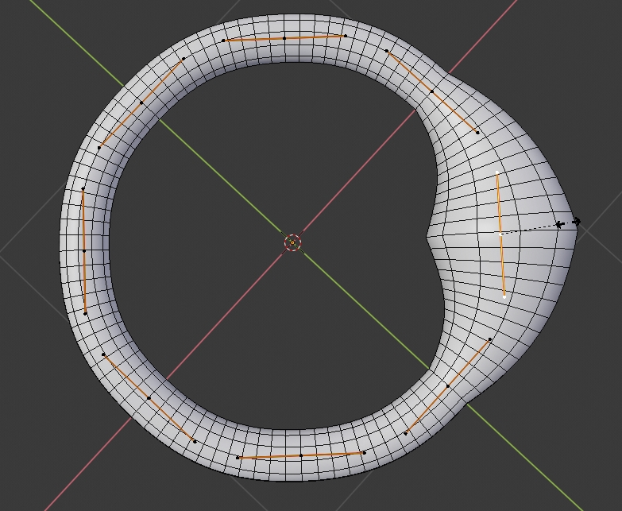 

缩放

▶ 曲线形变：Ctrl+P（操作流程：先选择模型，然后按Shift加选曲线，按Ctrl+P选择曲线形变，再选择模型打开模型的修改器面板，然后调节坐标）

 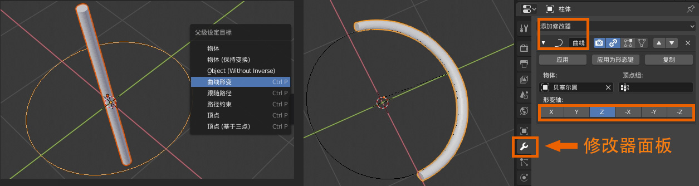 

曲线形变01

 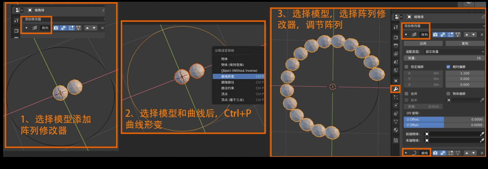 

曲线形变02

▶ 将曲线转换为模型（要在物体模式下）：

 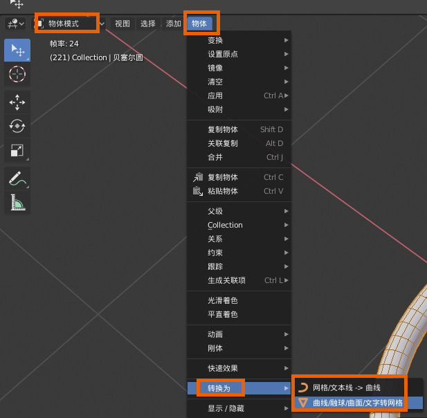 

将曲线转换为模型yige

# **UV编辑**

▶ 标记缝合边：线级别下选择要断开的边，然后右键选择【标记缝合边】，再按U键展开UV（UV编辑下）。

▶ 图钉：P  （这个会经常用到。比如点对齐，先要打图钉才能对齐。）

▶ 选择孤立的UV：L

# **着色编辑器（要在选择着色器编辑器的情况下才能用）**

 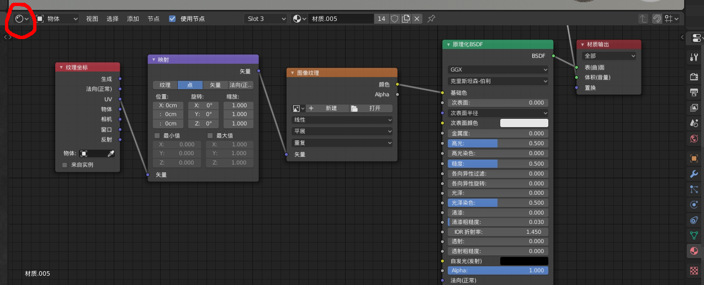 

着色编辑器

**▶ 刷新贴图（Reloaded images）：Alt+R（更新贴图时不用手动加载每张贴图了）（前提：开启Node:Node Wrangler插件）
**

**▶ 添加材质节点：Shift+A** 

**▶ 断开节点所有链接：Alt+左键拖动节点即可
**

▶ 断开节点链接：Ctrl+右键拖动鼠标在连接线上画线即可断开链接

 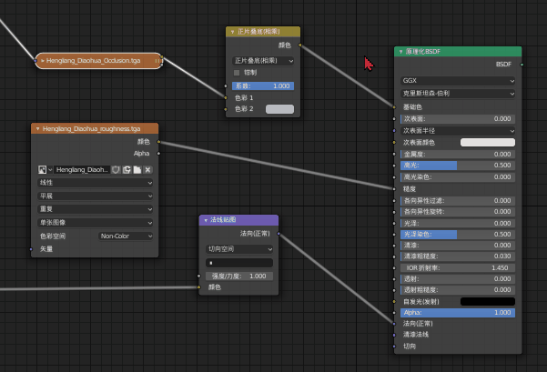 

断开节点链接

**▶ 插件Node:Node Wrangler（作用：自动添加并连接相关节点；操作：选择某个节点后，按Ctrl+T）
**

 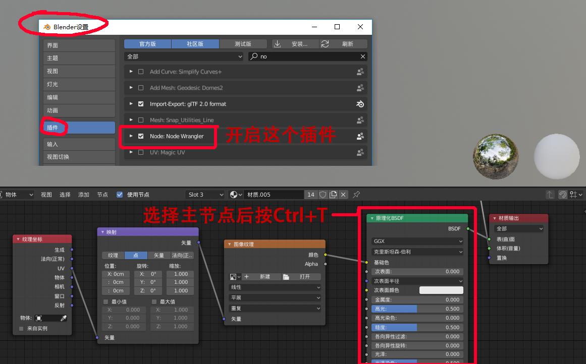 

**▶ 单独预览某个节点：Ctrl+Shift+左键点击节点（前提：开启Node:Node Wrangler插件）**

# **动画**

▶ 播放/暂停：空格键

#  **雕刻**  

**▶ 笔刷缩放：**按F，然后移动鼠标，左键确认。右键是取消。

**▶ 笔刷强度：Shift+F**

**▶ 平滑细节：Shift+左键
**

**▶ 反向雕刻（凹凸）：Ctrl+左键
**

#### **▶ 投射纹理：1.移动纹理（右键）；2.旋转纹理（Ctrl+ 右键）3.缩放纹理（Shift+ 右键）**

▶ 空格键： 显示隐藏操纵杆

----------------------------------------------------------------------------------------------------------------------------------------------------------------

g:移动（gx，gy，gz沿着各轴移动，g+shift+z沿xy平面移动）**

**s：缩放（sx，sy，sz沿着各轴缩放）**

**r: 旋转（rx，ry，rz沿着各轴旋转）**

z：线框模式

**n：打开菜单**

b：框选     可以选择多个物体

c：圈选（鼠标左键选择，鼠标中间调整圆圈半径，鼠标右键取消选择）

TAB  切换编辑模式 （Object Mode 和Editor Mode）

在Editor Mode 下  1：点  2：线  3：面

**shift**

**shift+a：添加（新建）**

**shift+d: 复制** 

shift+r：重复上一步操作

shift+z查看渲染效果

shift+s：游标位置选择

shift+c：游标回归到中心

**Ctrl**

ctrl+r：环切

Ctrl+i :反选   比方说想选中除去该物体之外的物体

**Ctrl+j: 合并物体**   多个物体合并为一个整体

Ctrl+p：父级绑定

ctrl+l: 关联项

Ctrl+2：表面细分

Ctrl+4：光滑着色

**Ctrl+alt：选择一条边，然后按住alt+Ctrl，可以选择并排边** 

Ctrl+t :打开节点

**Ctrl+空格：  视图最大化显示**

Ctrl+Alt+空格  ： 切换全屏模式

**Alt**

alt+d：关联复制

**alt：选择一条边，然后按住alt，可以选择循环边**

旋转+shift:缓慢旋转	

旋转+Ctrl:按刻度旋转

