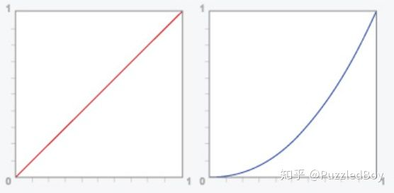
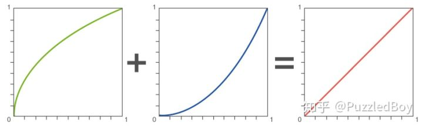
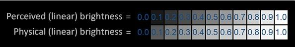
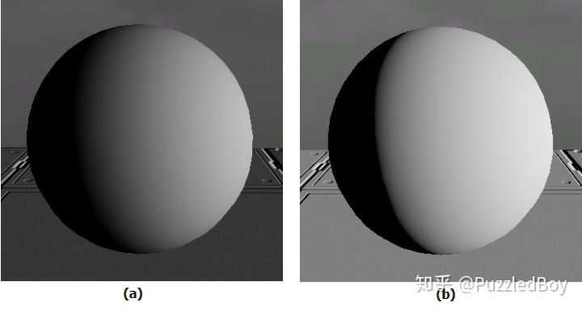
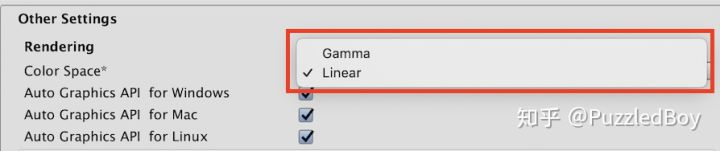
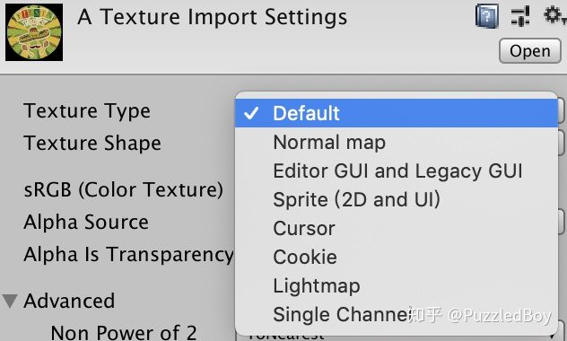
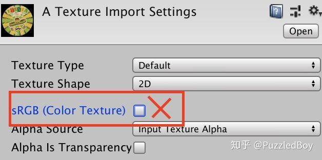

Gamma、Linear、sRGB、伽马校正等概念经常说，但是真有详细的说出来，真不好解释。本文就好好整理分析下这些概念及用途。

### 什么是Gamma、Linear、sRGB和伽马校正

#### Gamma 、Linear Space

在物理世界中，如果光的强度增加一倍，那么亮度也会增加一倍，这是线性关系。

而历史上最早的显示器(阴极射线管)显示图像的时候，输出亮度和电压并不是成线性关系的，而是亮度等于电压的2.2次幂的非线性关系：

![[公式]](imgs/equation.svg)

2.2也叫做该显示器的**Gamma**值，现代显示器的Gamma值也都大约是2.2。

这种关系意味着当电压线性变化时，相对于真实世界来说，亮度的变化在暗处变换较慢，暗占据的数据范围更广，颜色整体会偏暗。

如图，直线代表物理世界的**线性空间（Linear Space）**，下曲线是显示器输出的**Gamma2.2空间（Gamma Space）**。



​                         横坐标表示像素实际的亮度数值，纵坐标表示显示时像素对应的亮度数值

#### 伽马校正

正常情况下，人眼看物理世界感知到了正常的亮度。而如果显示器输出一个颜色后再被你看到，即相当于走了一次Gamma2.2曲线的调整，这下子颜色就变暗了。如果我们在显示器输出之前，做一个操作把显示器的Gamma2.2影响平衡掉，那就和人眼直接观察物理世界一样了！这个平衡的操作就叫做**伽马校正。** 

在数学上，伽马校正是一个约0.45的幂运算（和上面的2.2次幂互为逆运算）：

![[公式]](imgs/equation-1572062035902.svg)

                

​                                   左(Gamma0.45) 中(Gamma2.2) 右(线性物理空间)

经过0.45幂运算，再由显示器经过2.2次幂输出，最后的颜色就和实际物理空间的一致了。

#### sRGB

**什么是sRGB呢？**1996年，微软和惠普一起开发了一种标准**sRGB**色彩空间。这种标准得到许多业界厂商的支持。**sRGB对应的是Gamma0.45所在的空间**。

**为什么sRGB在Gamma0.45空间？**

假设你用数码相机拍一张照片，你看了看照相机屏幕上显示的结果和物理世界是一样的。可是照相机要怎么保存这张图片，使得它在所有显示器上都一样呢？ 可别忘了所有显示器都带Gamma2.2。反推一下，那照片只能保存在Gamma0.45空间，经过显示器的Gamma2.2调整后，才和你现在看到的一样。换句话说，**sRGB格式相当于对物理空间的颜色做了一次伽马校正**。

还有另外一种解释，和人眼对暗的感知更加敏感的事实有关。



如图，在真实世界中（下方），如果光的强度从0.0逐步增加到1.0，那么亮度应该是线性增加的。但是对于人眼来说（上方），感知到的亮度变化却不是线性的，而是在暗的地方有更多的细节。换句话说，**我们应该用更大的数据范围来存暗色，用较小的数据范围来存亮色。**这就是sRGB格式做的，定义在Gamma0.45空间。而且还有一个好处就是，由于显示器自带Gamma2.2，所以我们不需要额外操作显示器就能显示回正确的颜色。

**注意：**

1.  显示器的输出在Gamma2.2空间。
2. 伽马校正会将颜色转换到Gamma0.45空间。
3. 伽马校正和显示器输出平衡之后，结果就是Gamma1.0的线性空间
4. sRGB对应Gamma0.45空间

#### **统一到线性空间**

在Gamma 或 Linear空间的渲染结果是不同的，从表现上说，在Gamma Space中渲染会偏暗，在Linear Space中渲染会更接近物理世界，更真实：

								         左（Gamma Space），右（Linear Space）

  统一到线性空间的过程是看起来是这样的，用图中橙色的框表示： 

#### **Unity中的Color Space**

  Unity中，在ProjectSetting中，你可以选择Gamma 或 Linear作为Color Space：  

**这两者有什么区别呢**？

如果选择了Gamma，那Unity不会对输入和输出做任何处理，<u>换句话说，Remove Gamma Correction 、Gamma Correction都不会发生，除非你自己手动实现。</u>

如果选了Linear，那么就是上文提到的统一线性空间的流程了。<u>对于sRGB纹理，Unity在进行纹理采样之前会自动进行Remove Gamma Correction。而在输出前，Unity会自动进行Gamma Correction再让显示器输出。</u>

你还需要小心格式的问题，在Linear下Unity会将纹理默认为sRGB格式，对于Normal Map、Light Map、UI等纹理，它们都不是sRGB，Unity可以让你直接修改成相应的类型：



还有一些纹理不是上面的任何类型，但又已经在线性空间了（比如说Mask纹理、噪声图），那你需要取消这个选项让它跳过Remove Gamma Correction过程：



还有，在Linear Space下，Shaderlab中的颜色输入也会被认为是sRGB颜色，会自动进行Gamma Correction Removed。

有时候你可能需要想让一个Float也被Gamma Correction Removed，那么就需要在ShaderLab中使用[Gamma]前缀：

```zephir
[Gamma]_Metallic("Metallic",Range(0,1))=0
```

如上面的代码，来自官方的Standard Shader源代码，其中的_Metallic这一项就带了[Gamma]前缀，表示在Lienar Space下Unity要将其认为在sRGB空间，进行Gamma Correction Removed。

**扩展：为什么官方源代码中_Metallic项需要加[Gamma]？**这和底层的光照计算中考虑能量守恒的部分有关，Metallic代表了物体的“金属度”，如果值越大则反射(高光)越强，漫反射会越弱。在实际的计算中，这个强弱的计算和Color Space有关，所以需要加上[Gamma]项。

虽然Linear是最真实的，但是Gamma毕竟少了中间处理，渲染开销会更低，效率会更高。上文也说过不真实不代表是错的**，**毕竟**图形学第一定律：如果它看上去是对的，那么它就是对的**。

**注**：在Android上，Linear只在OpenGL ES 3.0和Android 4.3以上支持，iOS则只有Metal才支持。

#### 参考链接：

https://zhuanlan.zhihu.com/p/66558476