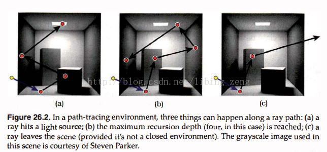

Path Tracing是一种“全局光照算法”。

Path Tracing是一种计算有面积光源的场景中的直接光照和间接光照的简单粗暴的概念上理想的技术。

之所以说其“简单”，是因为“原理简单”。

之所以说其“粗暴”，是因为“如要消除图形中可见的噪音，需要耗费的时间特别长”。

之所以说其“概念上理想”，是因为“其一，能够模拟所有光线，所以‘理想’；其二，费时，所以只能停留在‘概念上’”。

**Path Tracing的过程：**



```
一条光线进入场景（如上图中黄色起点的光线），然后开始追踪这条光线。过程中光线会因为撞击到场景中的物体而发生反射（可能是任何BRDF）。一直追踪，一直追踪，直到：

光线撞击到发光材质的物体（如a图所示）；

或者：达到最大反射次数（如b图所示）；

或者：离开了场景（如c图所示）。

如上三种情况，只有“撞击到发光材质的物体”情况，返回的是发光材质的光；其他两种情况返回的是背景色（黑色）。
```

