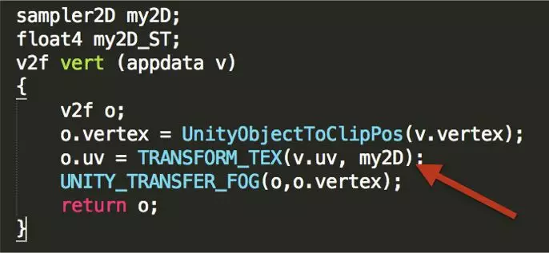
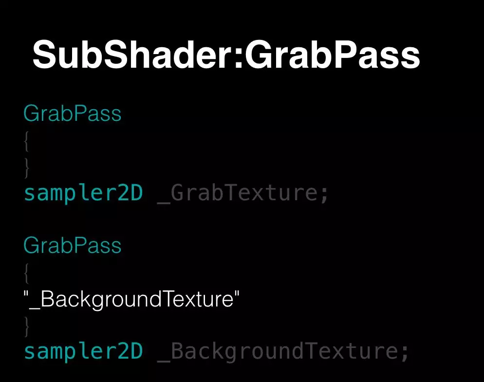

### Gamma和Linear标签

[Gamma]和[Linear] 指定，当颜色空间配置为Gamma时，对属性变量指定为[Gamma]和[Linear]都是无效的，只有当颜色空间配置为Linear时，指定才有效果。所以当我们需要将一个Vector作为颜色使用时，在Linear颜色空间下，指定其为[Linear]是比[Gamma]要高效的，因为如果指定为[Gamma]，Unity会在CPU端做一次转换计算。

### NoScaleOffset

[NoScaleOffset]可以为我们省掉一个变量的分配，如果不需要用到纹理Tiling和Offset，请使用[NoScaleOffset]。



### PerRenderData

属性里面还有一个PerRenderData，如果有一个物体，我们进行渲染一百次，是同一个材质，但是我们有时候又需要这一百个物体显示为不同的颜色，那么怎么做？一种方法是顶点色这样做，但是这种方法不是特别好，我们还有一种方法可能是直接在材质属性里面加一个颜色，然后每个材质设不同的颜色。

如果要为每个材质设不同的颜色，Unity会帮助你创建一百个这样的材质，相当于你渲染一百个物体，每个物体颜色不一样，所以直接设置的时候，会帮助你创建一百个材质，这对于GPU来讲会影响，但是更重要是内存方面，会有一百个材质的内存开销，这是一个最大的瓶颈。所以我们引入了PerRenderData的这么一个属性的控制，它可以帮你把这个数据。例如：Color颜色，我们不需要将其画到材质里面，而是通过Render可以设置。

### Tags

Tags指定渲染顺序，告诉引擎如何以及何时将其渲染。Unity提供给我们一些默认的渲染队列，每一个对应一个唯一的值，来指导Unity绘制对象到屏幕上。这些内置的渲染队列被称为Background, Geometry, AlphaTest，这些队列不是随便创建的，它们是为了让我们更容易地编写Shader并处理实时渲染的。

下面是队列的描述：

- Background：队列通常被最先渲染。	
- Geometry：默认的渲染队列。它被用于绝大多数对象。不透明几何体使用该队列。
- AlphaTest：通道检查的几何体使用该队列。它和Geometry队列不同，对于在所有立体物体绘制后渲染的通道检查的对象，它更有效。	


我们优化的时候对于不透明的物体不需要从后往前画，例如：很远的山或者背景，作为Background，前面作为Geometry，其实前景应该先画，然后再画后景。

有时候Unity处理的比较粗糙，更多时候需要大家自己进行控制。半透明必须从后往前画，这里没有太多办法进行优化。DisableBatching建议大家不要开启，默认的情况是不开启的。

ForceNoShadowCasting，例如：当我们画不透明的物体，需要替换半透明的物体，但是半透明的物体没有阴影，你可以更改Shader代码让它不投射阴影，直接加上ForceNoShadowCasting就可以了。

### GrabPass



这二种方式的区别是很明显的，第一种方式是比较低效的，因为GrabPass调用的时候必定会进行抓取的操作，所以没次都是不同的。但是下面比较高效，一帧里面最多只执行一次，就是第一次使用会执行，后面不会执行。这个根据大家的实际的应用进行选择。

### 代码


我们在代码优化的几个重点：

- 我们要保证效果的前提下，尽量把计算放在Vertex Shader 。
- 我们尽量不要写多pass SubShader。
- 我们善用LOD，我们Mesh有LOD，纹理有Mipmap，Shader也有LOD。GPU执行二个Float的乘法和执行二个Vector4的乘法效率是一样的。
- 少用分支， 还有一些内置函数，不建议自定义实现，我们可以使用提供的函数，那些是经过优化的。
- 最后是精度问题，Fixed，Half、Float，不同的设备上它的性能不一样，我们尽量移动端使用一些低精度的数据。PC端这三种是没有什么区别的。

### 变体剔除技巧

1.Skip_variants

2.OnProcessShader （Unity2018.2 之后）

```ShaderLab
using System.Collections.Generic;
using UnityEditor;
using UnityEditor.Build;
using UnityEditor.Rendering;
using UnityEngine;
using UnityEngine.Rendering;
 
class ShaderDebugBuildProcessor : IPreprocessShaders
{
    ShaderKeyword m_KeywordDebug;
 
    public ShaderDebugBuildProcessor()
    {
        m_KeywordDebug = new ShaderKeyword("DEBUG");
    }
 
    public int callbackOrder { get { return 0; } }
    public void OnProcessShader(
        Shader shader, ShaderSnippetData snippet, IList<ShaderCompilerData> shaderCompilerData)
    {
        if (EditorUserBuildSettings.development)
            return;
 
        for (int i = 0; i < shaderCompilerData.Count; ++i)
        {
            if (shaderCompilerData[i].shaderKeywordSet.IsEnabled(m_KeywordDebug))
            {
                shaderCompilerData.RemoveAt(i);
                --i;
            }
        }
    }
}
```

3.组合变体

```
#pragma multi_compile COLOR_ORANGE COLOR_VIOLET COLOR_GREEN COLOR_GRAY // color keywords
#pragma multi_compile OP_ADD OP_MUL OP_SUB // operator keywords
```

首先，我们要确认每个关键字都是有用的。在这个场景中，COLOR_GRAY和OP_SUB从未被使用。如果我们可以确定这些关键字从未被使用，那么我们就应该把它们移除。

 其次，我们会结合能够高效产生代码路径的关键字。本例中，“add”（添加）运算仅会和 “orange”颜色一同使用。所以，我们可以把它们结合为单个关键字并重构代码，如下所示。

```ShaderLab
#pragma multi_compile ADD_COLOR_ORANGE MUL_COLOR_VIOLET MUL_COLOR_GREEN
 
#if defined(ADD_COLOR_ORANGE)
#define COLOR_ORANGE
#define OP_ADD
#elif defined(MUL_COLOR_VIOLET)
#define COLOR_VIOLET
#define OP_MUL
#elif defined(MUL_COLOR_GREEN)
#define COLOR_GREEN
#define OP_MUL
#endif
```

