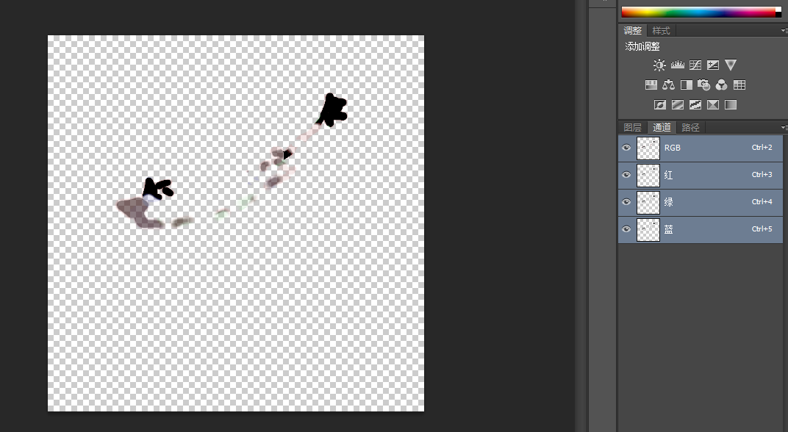
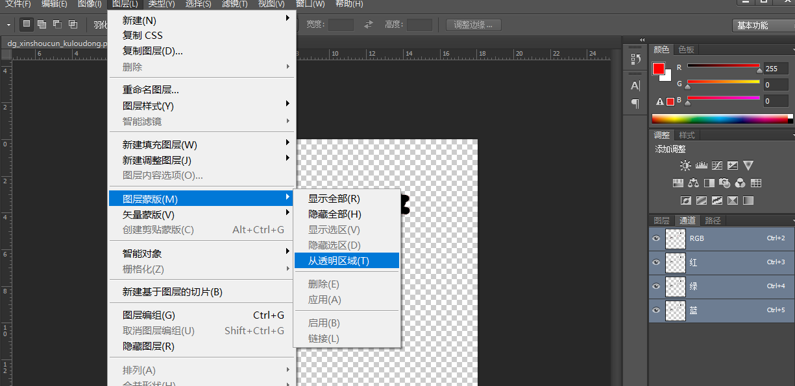
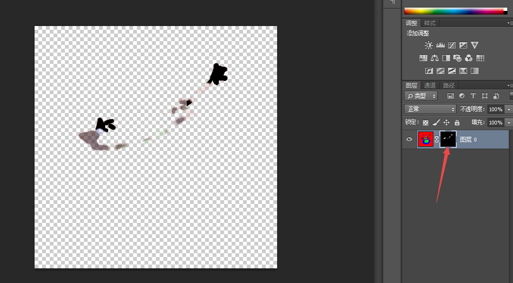

之前项目使用T4M工具把Unity地形导出成Mesh，导出后的SplitTexture 贴图是RGBA32格式，在Unity中预览窗口是这样的效果：

 美术想在ps中修改这张贴图，导入ps后是这样的，？？？？ rbg通道都是一样的，跟Unity显示的完全不一样。

 

**原因：**因为贴图默认是Premultiplied Alpha，rgb通道都跟alpha进行预乘。

**解决方法：**

删除上图箭头指向的蒙版即可。

