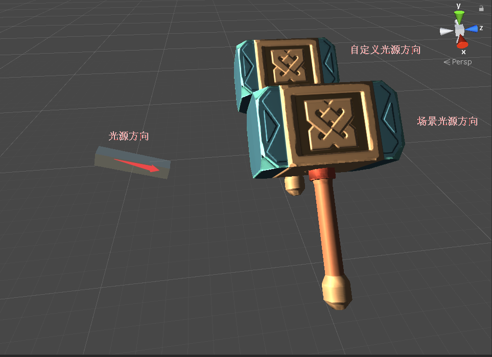
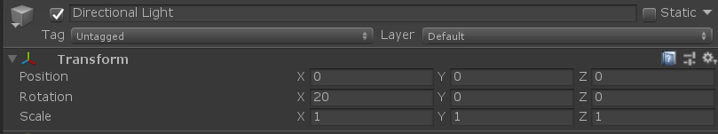
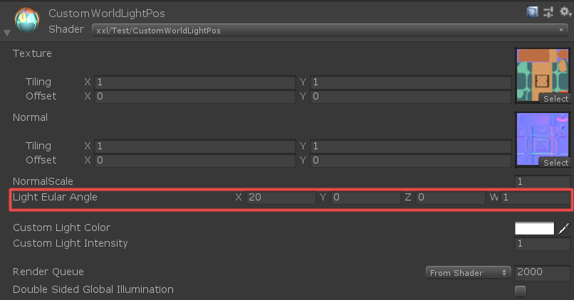
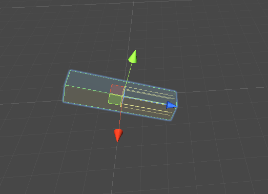
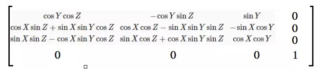

### 概述

最近美术这边有个需求，角色光照不受场景的影响。就是说，调整场景主光源的方向，强度，颜色，角色不能跟着调整。于是研究了一番，颜色和强度好实现，主要就是光源的方向，最后实现效果截图。



光源方向：



自定义光源方向材质面板



可以看到自定义光源方向跟主光源方向是一致的。

### 具体实现

#### Unity 内置光源方向  _WorldSpaceLightPos

一个普通的光照shader，ambient+ diffuse + specular 就行了，当然如果你想弄pbr也是可以的。核心代码：

```Shaderlab
 half3 lightDir=_WorldSpaceLightPos0.xyz;   //光源方向
 //Ambient
				fixed3 ambient=UNITY_LIGHTMODEL_AMBIENT.xyz*baseColor.rgb;
				//diffuse 
				fixed diff=max(0,dot(worldNormal,lightDir));
				float3 diffuse=baseColor.rgb*diff;

				//specular 
				fixed3 halfDir=normalize(lightDir+viewDir);
				fixed nh=saturate(dot(worldNormal ,halfDir));
				fixed spec=  pow(nh,0.071*64) ;
				float3 specular= baseColor.rgb*spec;
				// Final Color:
				float3 finalColor =ambient+ (diffuse + specular)*_CustomLightInten*_CustomLightColor;
```

**注意**：这里我们用的是平行光照的方向

```
 half3 lightDir=_WorldSpaceLightPos0.xyz; 
```

点光源等其他光源:

```
  half3 lightDir= _WorldSpaceLightPos0.xyz - worldPos;
```

当然还可以偷懒，直接使用Unity内置函数（在Unity.cginc中）：

```ShaderLab
// Computes world space light direction, from world space position
inline float3 UnityWorldSpaceLightDir( in float3 worldPos )
{
    #ifndef USING_LIGHT_MULTI_COMPILE
        return _WorldSpaceLightPos0.xyz - worldPos * _WorldSpaceLightPos0.w;
    #else
        #ifndef USING_DIRECTIONAL_LIGHT
        return _WorldSpaceLightPos0.xyz - worldPos;
        #else
        return _WorldSpaceLightPos0.xyz;
        #endif
    #endif
}
```

#### 自定义光源方向

自定光源方向其实就是要把_WorldSpaceLightPos0这个变量值重新计算。那么这个_WorldSpaceLightPos0怎么计算呢，想明白了就很简单。

**原理：**



假设，光源初始方向是（0,0,1）, 按照欧拉角旋转（x,y,z）之后的方向就是光源方向。那么就能够得出计算公式：

```
旋转之后的光源方向=mul(旋转矩阵，光源的初始方向)
```

有了公式那么就实现下：

```
float4x4 matrixRota=GetRotateMatrix(_EularAngle);
float4 baseDir=float4(0,0,1,0);   //自身坐标系 z轴方向  Unity中的初始光源方向
o.lightDir=mul(matrixRota,baseDir); //旋转_EularAngle 之后的方向   作为光照方向
```

好了，lightDir里面存储的值就是_WorldSpaceLightPos0。等等，这个GetRotateMatrix函数如何实现的呢？？？

首先来看下旋转矩阵公式（请自行推到哦，不会就百度吧）：



有了公式就对照着实现就完了。

```
	inline float4x4 GetRotateMatrix(float3 eularAngle)
			{
				eularAngle.xyz*=0.01745;  //UNITY_PI/180     角度转弧度
				//X轴旋转
				float angleX=eularAngle.x;
				//Y轴旋转
				float angleY=eularAngle.y;
				//Z轴旋转
				float angleZ=eularAngle.z;

				float sinX=sin(angleX);
				float cosX=cos(angleX);
				float sinY=sin(angleY);
				float cosY=cos(angleY);
				float sinZ=sin(angleZ);
				float cosZ=cos(angleZ);

				float m00=cosY*cosZ;
				float m01=-cosY*sinZ;
				float m02=sinY;
				float m03=0;
				float m10=cosX*sinZ+sinX*sinY*cosZ;
				float m11=cosX*cosZ-sinX*sinY*sinZ;
				float m12=-sinX*cosY;
				float m13=0;
				float m20=sinX*sinZ-cosX*sinY*cosZ;
				float m21=sinX*cosZ+cosX*sinY*sinZ;
				float m22=cosX*cosY;
				float m23=0;
				float m30=0;
				float m31=0;
				float m32=0;
				float m33=1;

				float4x4 matrixRota=float4x4(m00,m01,m02,m03,m10,m11,m12,m13,m20,m21,m22,m23,m30,m31,m32,m33);
				return matrixRota;
			}
```

旋转矩阵也求出来，那么上面的shader代码稍微做下调整：

```
 half3 lightDir=-i.lightDir   //自定义的光源方向，注意反方向哦
 //Ambient
				fixed3 ambient=UNITY_LIGHTMODEL_AMBIENT.xyz*baseColor.rgb;
				//diffuse 
				fixed diff=max(0,dot(worldNormal,lightDir));
				float3 diffuse=baseColor.rgb*diff;

				//specular 
				fixed3 halfDir=normalize(lightDir+viewDir);
				fixed nh=saturate(dot(worldNormal ,halfDir));
				fixed spec=  pow(nh,0.071*64) ;
				float3 specular= baseColor.rgb*spec;
				// Final Color:
				float3 finalColor =ambient+ (diffuse + specular)*_CustomLightInten*_CustomLightColor;
```

好了，终于实现了自定义光源的方向，美术只需要在材质上设置一个旋转角度就行了。

### 项目源码

csdn 下载 ：https://download.csdn.net/download/a958832776/11862748

### 参考链接

https://gameinstitute.qq.com/community/detail/117692