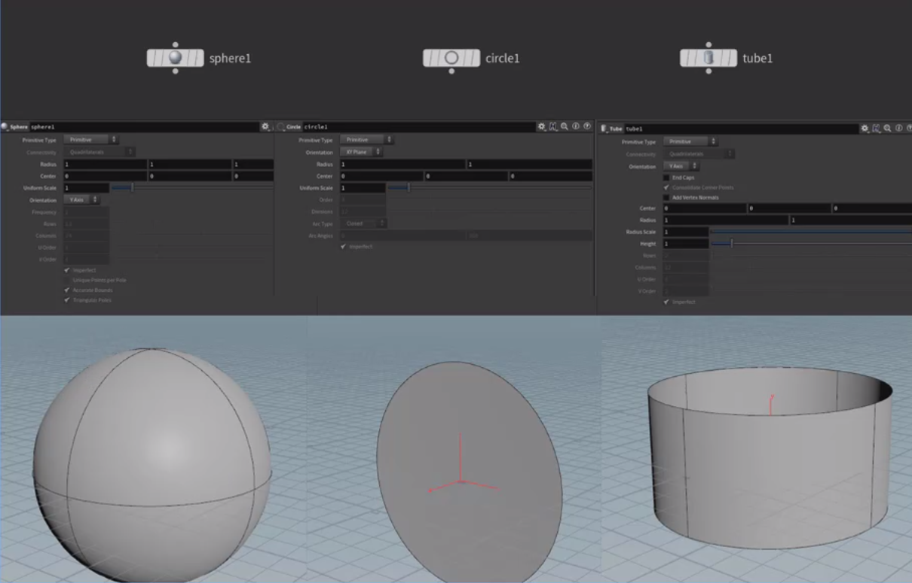
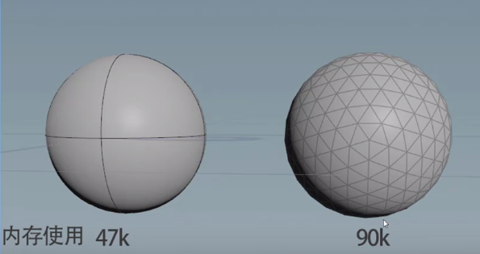
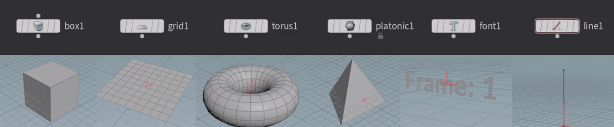

### primitive基础程序化模型

houdini中的默认的primitive程序化模型只有3个，分别是sphere，circle和tube。

sphere primitive 

只需要一个中心点center和一个半径radius就可以定义一个完美的球。

circle primitive

只需要一个中心点center和一个半径radius就可以定义一个完美的圆形。

tube primitive

只需要一个中心点，一个半径radius和高度height就可以定义一个完美的圆管。

### primitive类型的特点

1.只有一个点，那就是中心点，模型上没有其他可编辑的点，所以不可以进行点编辑操作。

2.primitive与polygon的关系类似与矢量和位图的关系，primitive类型通过中心点和一些基本基本参数比如半径和高度就可以构建出一个完美形态，占用内存很少。而polygon需要多个点才能描述一个模型，并且点数越多，越平滑。

3.由于primitive性能优越，经常用于大量替代或者充当代理物体(包括刚体解算和控制器)。

**其他常用的几何体形态没有primitive类型**

box 方形 ，grid 平面 ，torous 圆环，platonic正多面体，font 文字，line 直线

**polygon和mesh的特性**

1.open/closed

打开/闭合，只有闭合的polygons才会有光影效果shading。

2.planar/non-planar

共面和非共面：共面的意思是所有的vertices都是一个平面上的，而非共面的模型的vertices不完全在一个平面上。三角面肯定是共面的，但是四边面或者多边面就不一定共面。

3.convex/concave 凸面和凹面

4.正面还是反面  法线的作用

正面反面（法线）其实是由vertices的链接顺序决定的。

面的正反除了控制了光影渲染信息，还包括与面交互的控制信息（比如碰撞和投射）

**polygon和mesh的区别**

- polygon多边形是由一系列的直线边构成的，这些边由一系列的顶点构成。多边形支持复杂的拓扑结构，包括多余四个边的面。大部分的普通polygon可以直接转化为NURBS模型。

- mesh是带有一定序号排列的多边形的一个合集，它比同等数量的polygon效率更高。如果mesh转为NUBRs模型会变成一个整体。

- polygon 和polygonmesh 本质上是一样都是polygon类型，只是布线不一样。
- polygon mesh和mesh虽然表面上看起来一样(布线一样)但是本质上是不一样的。polygon mesh其实是多块polygon的结合。而mesh看起来虽然有很多面，但是它整体就是一个mesh。

