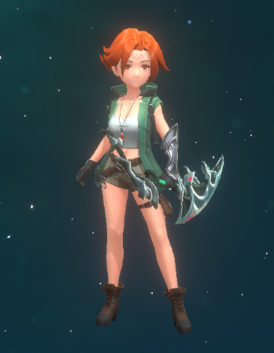
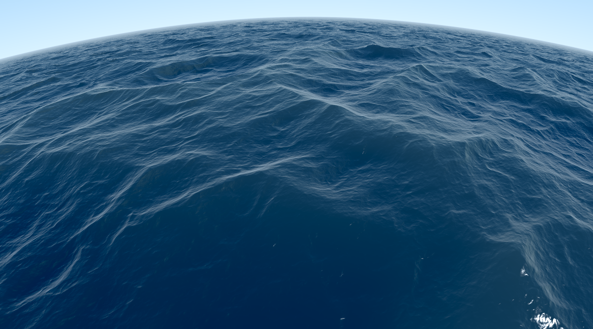

本文是Shader基础篇的第一篇，主要介绍介绍shader。

## 什么是shader

Shader就是着色器，是**GPU上的一段代码**，它会告诉GPU怎么来绘制我们想要的图形效果。

### 常见类型

我们通常使用的Shader有2种，<u>顶点着色器</u>和<u>像素（片段或片元）着色器</u>。当然其它类型的着色器不常用，会在后面的教程中再讨论。

### Shader编程语言

1.**GLSL -- 基于OpenGL**

2.**HLSL -- 基于DirectX**

3.**NVIDIA 的Cg**

### Unity的ShaderLab

Unity中的shader是经过Unity封装之后的Shader，称之为ShaderLab。官方建议用**Cg/HLSL**来编写。

Unity中常见的Shader种类

#### 表面着色器

就是我们常说的Surface Shader，它其实就是顶点/片段着色器的一种包装，方便开发而已，Unity编译时会转换成顶点/片段着色器。

#### 顶点/片段着色器

顶点/片段着色器对初学者可能不太友好，需要自己去实现最基础的内容，但是入门之后就会发现，Surface Shader的局限性太大了。顶点/片段着色器控制起来更加方便。

#### 固定管线着色器（淘汰了，了解下就行）

## Shader能干啥？

上面介绍了一堆的Shader概念，那么Shader究竟能干啥呢？哈哈，Shader的功能非常强大，它能帮你实现各种炫酷的效果，比方说热扭曲、海水、云海、体积雾、体积光，PBR、NPR等等，还能帮助你实现复杂的并行计算（这是GPU的优势所在）。

​                                                               PBR实现的角色

​                                                                                海水

​																	           云海

总结

本文内容不多，主要是介绍下Shader，Shader的简单分类及用途，让初学者对Shader有个了解，文中只是概述了初学者需要了解的内容，还有很多Shader的细节还是需要读者自行去探索。好了本文就到这里了，有什么不明白的或者想要了解的请留言。

