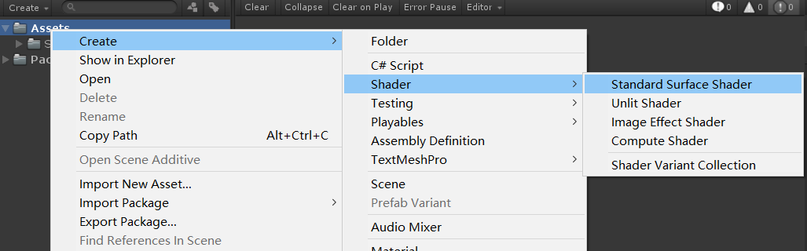
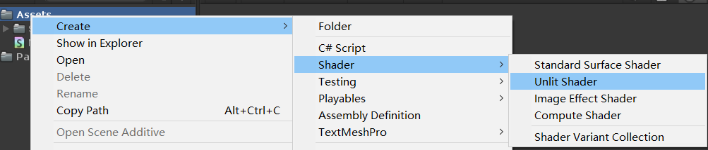
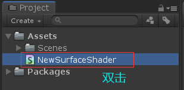

本文是Shader基础篇的第二篇，主要说说如何在Unity中使用Shader。

注意：本文是使用的Unity版本是Unity 2018.4.

## Surface Shader

在Unity中快速创建Surface Shader请看下面的截图。

按照上面的步骤就能在Unity中创建一个Surface Shader了，至于Shader里的内容本文先不讲解，后面章节会具体跟大家分析Shader代码的含义。

## Vertex/Fragment Shader

在Unity中快速创建顶点/片段着色器请看下面的截图。

根据上图的指引操作就能创建一个顶点片元着色器，对，没错，Unlit Shader就是一个简单的顶点片元着色器。

到这里，恭喜你，你已经会在Unity中创建Shader了，你向成功已经跨越了一大步。

## 查看Shader代码

创建完Shader代码，自然想看看这个Shader代码里写了啥，那么就需要一个编辑工具（下文称为IDE），这里根据大家的喜好自行安装IDE工具即可，比方说Sublime Text，Notepad++，vscode，visual studio等等。

如何设置请看下图：

根据自己安装的IDE，选择对应的IDE即可。

然后在Unity中双击文件即可打开对应的Shader。

## 总结

本文主要讲解了如何在Unity中快速创建Surface Shader和顶点/片段着色器。掌握了这些基本的操作为后面深入的学习打下坚实的基础。好了本文就写到这里，有什么不明白或者想要了解的可以留言。谢谢 ！

