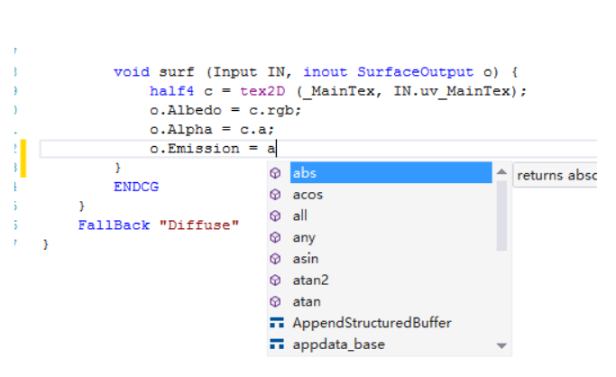
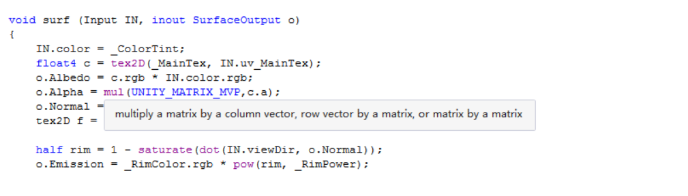
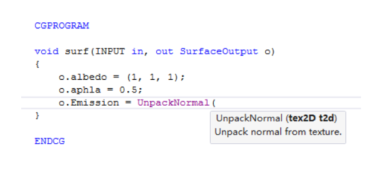

本文是Shader基础篇的第三篇，主要介绍下Shader开发的用到的便捷工具。

## 问题的来源

我在这里用Visual Studio开发。为啥要用VS呢，有那么多轻量级的IDE，不香么？香，真香，但是平时写代码用VS，习惯了。

写Shader其实跟写代码一个道理，就是把自己的想法用代码语言表达出来，这里不会美术的同学也不要急，后面会针对美术同学出个简单的代码教程。

如果一个Shader比较小还好，一个字母一个字母的敲，也没啥问题，但是，如果一个Shader有几百行，一个字母一个字母敲很累不说，还容易敲错，后面检查起来就非常痛苦。俗话说的好，懒人创造世界。有没有提示工具了，我输入一个字母就给我提示一堆，然后选择不就完事了么，跟写代码提示一样呢？骚年，很高兴的告诉你，有。下面就隆重的介绍下ShaderlabVS插件。

## ShaderlabVS

话不多说，直接看图

看到上面的图激动吧，这简直就是开发的神器啊，麻麻再也不用担心我写错单词了。香么，真香！

这里给上Github源码地址 https://github.com/wudixiaop/ShaderlabVS   ，大家根据自己的版本下载就行。

这里需要注意的是原来的作者只维护到了VS2017，并且新版本的Unity相关内容并没有更新，如果大家需要VS2019，支持版本的Unity，请使劲留言，我或给上**独家改良过的版本**，功能强大并且也支持后续的VS版本。

## 总结

本文给大家介绍了一款开发Shader的利器，他能够帮助大家快速的编写代码，麻麻再也不用担心我写错单词了。好了，本期的话题就讨论到这里，大家有什么不明白的，请留言。谢谢大家。

