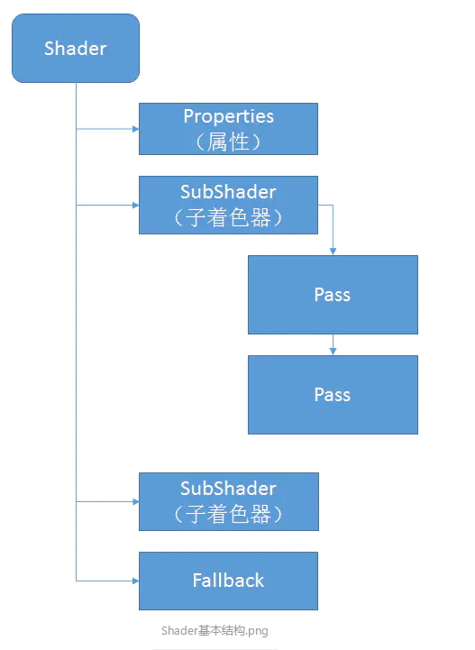
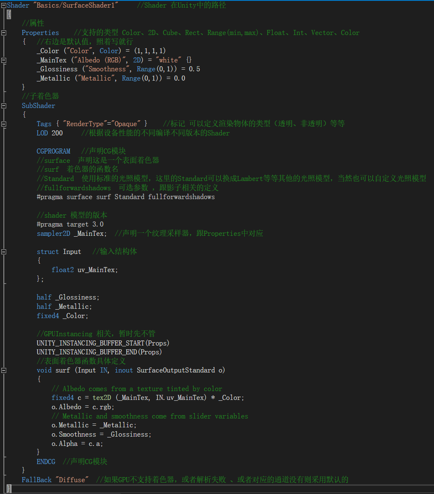
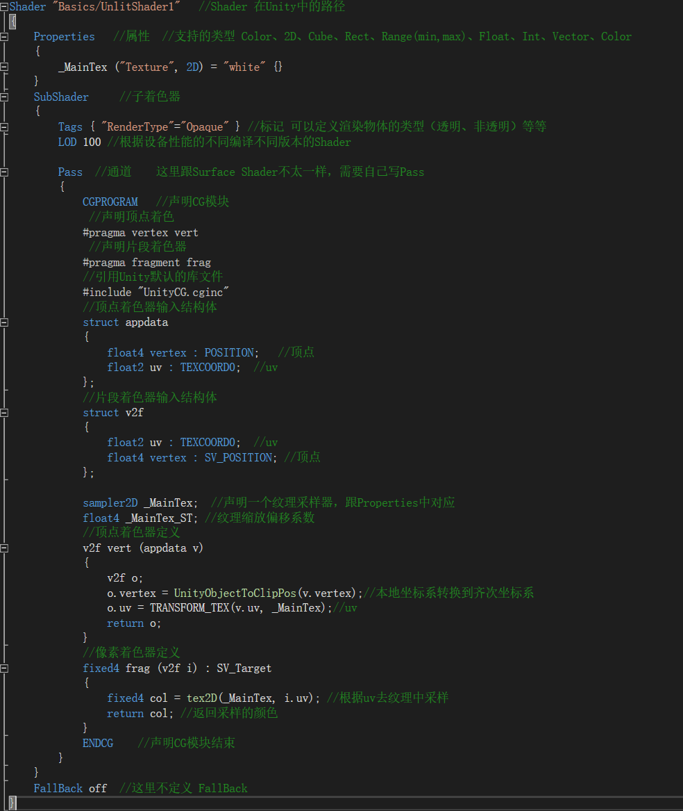

本文是Shader基础篇的第五篇，主要聊聊Shader的结构框架。

前面的几篇文章主要聊了Shader的一些基础东西，真正的Shader长啥样并没有给大家去具体分析，主要是不想让大家那么快的接触，心里有压力。既然学习Shader肯定避免不了代码结构的学习，下面就开始具体去分析。

## Shader的通用结构

网上找来的Shader通用结构图，一看就明白了。

## Surface Shader

surface shader 具体结构分析：

## Vertex/Fragment

顶点/片元着色器的具体结构代码分析如下：

## 总结

本文主要介绍了Shader的结构，初学者需要牢记这些，后面写Shader都是基于这些结构去编写的。刚开始可能对某个地方不太理解，不要紧，多看几遍记住就行，时间长了，自然就懂了。本文的话题就讨论到这里，如有不明白的或者想要了解的，欢迎留言交流。