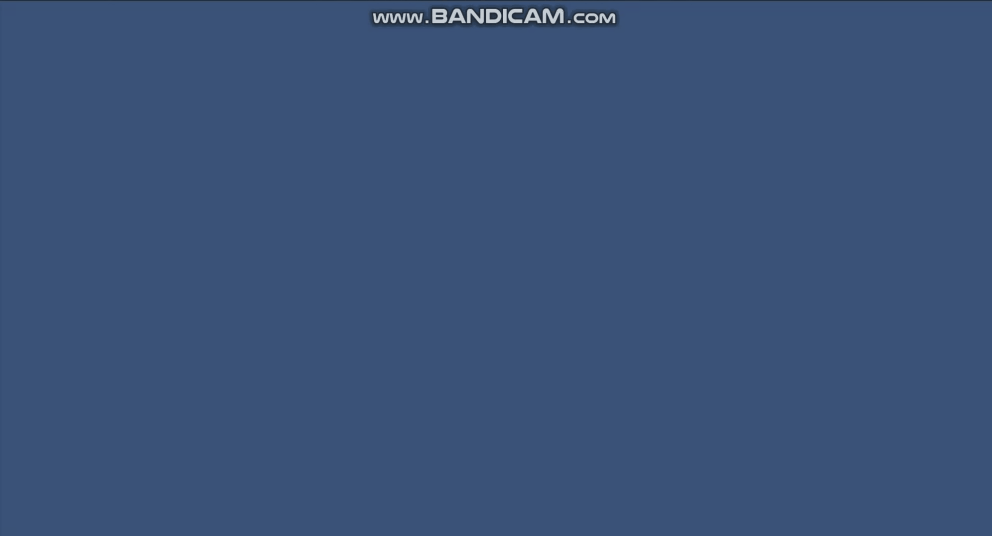
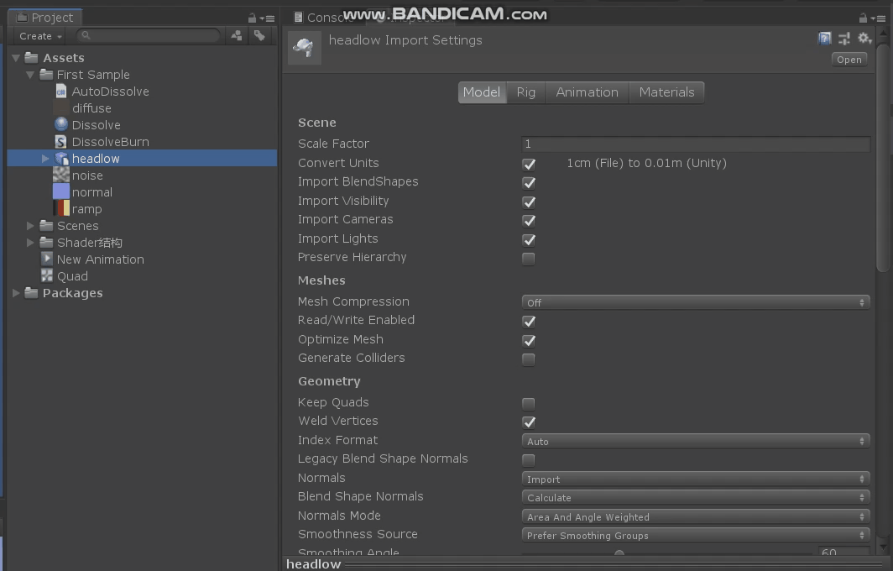
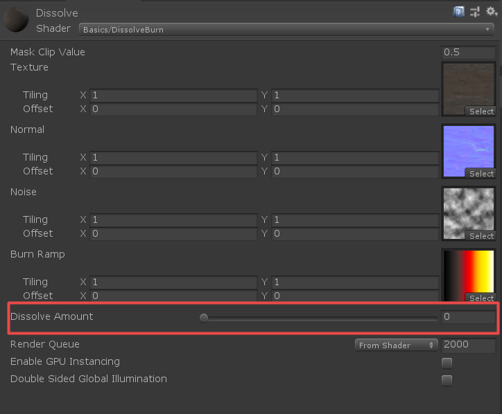
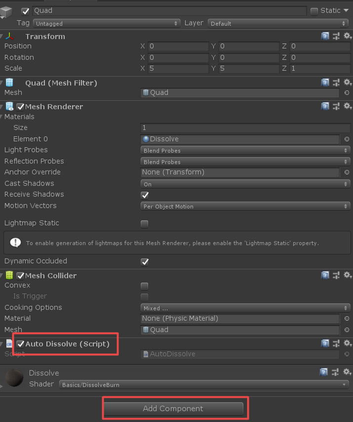

本文是Shader基础篇的第六篇，主要通过一个例子来巩固之前学的知识。

首先看下效果



主要知识点：利用噪声图采样实现溶解效果，Ramp图实现边缘发光。

## 核心代码

### Shader代码

Shader代码如下，Shader中有详细的分析。

```ShaderLab
Shader "Basics/DissolveBurn"
{
    Properties
    {
        _MaskClipValue("Mask Clip Value",Float)=0.5  //阀值
        _MainTex ("Texture", 2D) = "white" {}    //主纹理
        _Normal("Normal", 2D) = "bump" {}     //法线
		_Noise("Noise", 2D) = "white" {}  //噪声图
		_BurnRamp("Burn Ramp", 2D) = "white" {}  //渐变图
		_DissolveAmount("Dissolve Amount", Range( 0 , 1)) = 0 //溶解强度
    }
    SubShader
    {
        Tags { "RenderType"="Opaque" }  //标记 可以定义渲染物体的类型（透明、非透明）等等
        LOD 200   //根据设备性能的不同编译不同版本的Shader

        CGPROGRAM
        //surface  声明这是一个表面着色器
        //surf  着色器的函数名
        //Standard  使用标准的光照模型，这里的Standard可以换成Lambert等等其他的光照模型，当然也可以自定义光照模型
        //fullforwardshadows  可选参数 ，跟影子相关的定义
        #pragma surface surf Standard fullforwardshadows
        #pragma target 3.0

        sampler2D _Normal;float4 _Normal_ST;
		sampler2D _MainTex;float _DissolveAmount;
		sampler2D _Noise;float4 _Noise_ST;
		sampler2D _BurnRamp;
		float _MaskClipValue ;

        struct Input
        {
            float2 uv_MainTex;
        };

        void surf (Input i, inout SurfaceOutputStandard o)
        {
            //主纹理
            o.Albedo=tex2D(_MainTex,i.uv_MainTex).xyz;
            //法线
            float2 uv_Normal = i.uv_MainTex * _Normal_ST.xy + _Normal_ST.zw;
            o.Normal = tex2D( _Normal ,uv_Normal).xyz;
            //溶解uv，从噪声图里进行采样
            float2 uv_DisolveGuide = i.uv_MainTex * _Noise_ST.xy + _Noise_ST.zw;
            float4 disolveTex = tex2D( _Noise, uv_DisolveGuide);
            //溶解强度
            float dissolve = -0.6 + ( 1.0 - _DissolveAmount ) * 1.2  + disolveTex.r ;
            //边缘渐变效果
			float ramp =  1.0 - clamp(-4.0 + dissolve * 8.0,0,1) ;
			float2 uv_ramp = float2( ramp , 0 );
            //边缘渐变效果赋值给自发光
            o.Emission = (ramp * tex2D( _BurnRamp, uv_ramp )).xyz;
            //这里Alpha直接赋值为1，非透明
			o.Alpha = 1;
            //根据溶解强度和阀值进行裁剪
			clip( dissolve - _MaskClipValue );
        }
        ENDCG
    }
    FallBack "Diffuse"   //FallBack
}

```

有了Shader,我们可以选中Shader然后右键创建材质球，此时材质球会自动选择DissolveBurn.shader。当然也可以通过材质面板根据Shader路径进行选择。具体操作参见下图。



然后给材质球附上贴图（需要贴图的话请留言）。



注意上图中的红框标记的内容，这里我们会通过代码来动态的控制该值。

在场景中创建一个Quad，让后把材质给Quad。下面介绍脚本控制Shader中的值。

### C#脚本

C#相关代码如下：

```C#
using UnityEngine;

public class AutoDissolve : MonoBehaviour
{
    private Material mat;
    private int dissolveId = -1;
    void Start()
    {
        mat = GetComponent<Renderer>().material;
        dissolveId = Shader.PropertyToID("_DissolveAmount");  //跟Shader中定义的值相同
    }

    void Update()
    {
        if (mat != null)
        {
            mat.SetFloat(dissolveId, Mathf.Abs(Mathf.Sin(Time.realtimeSinceStartup)));
        }
    }
}

```

脚本中通过Sin函数来模拟波形，绝对值函数来控制取值在【0,1】之间。

在Quad的Inspector面板中添加AutoDissolve.cs 脚本。如图：




## 总结

文中的例子主要让初学者了解掌握Shader的基本知识点，初步学会通过C#来控制Shader中的变量进行交互。

需要工程代码的请留言。好了，本文讨论的话题就聊到这儿，有什么不明白的地方或想要了解的内容，请留言。谢谢！

