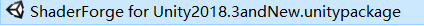
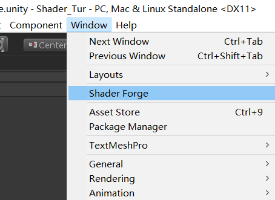
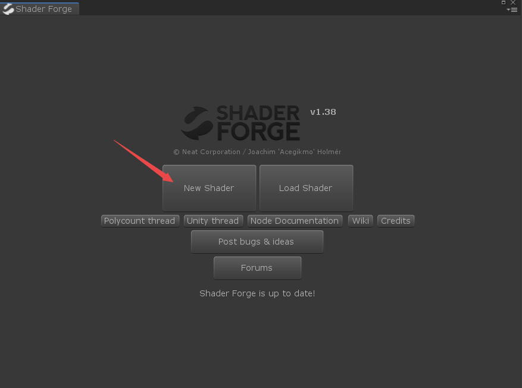
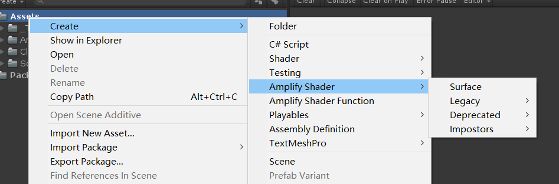
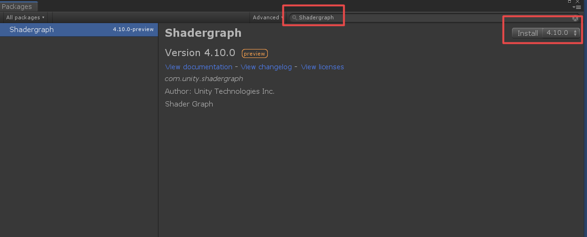
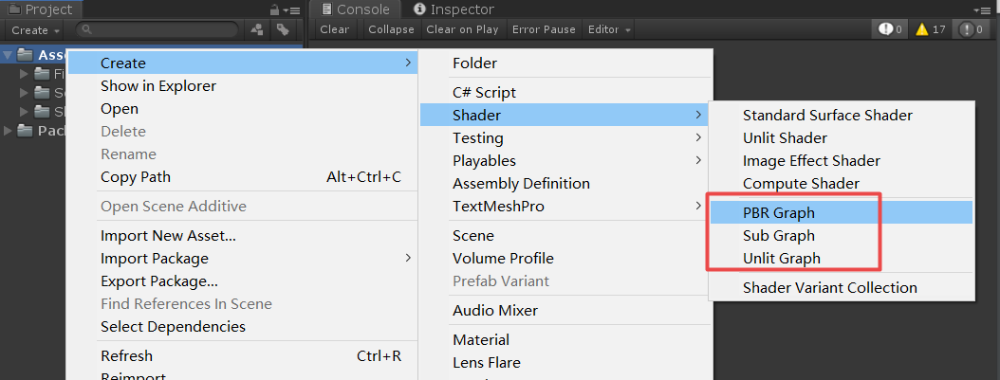

本文是Shader基础篇的第七篇，主要聊聊方便Shader开发的一些插件。

## 介绍

有这样的一个问题，我们可能发现一点点的写Shader代码其实还是很痛苦的，我们每次都需要去做一些重复的工作，并且还需要被一些算法折磨等等。那么有什么快速的办法解决这些么？当然有，下面就介绍下几款插件。有了这些插件，我们就不用关心那些基础以及细节的实现了，只需要关心效果实现即可。

## ShaderForge

这个插件是本人经常用也最喜欢的插件，为什么呢？原因有2点，第一点，ShaderForge节点使用起来方便，文档比较全；第二点，ShaderForge生成的代码是Vertex/Fragment代码，便于查看及优化Shader代码。

1.直接拖拽导入ShaderForge组件（需要组件的留言）

2.导入Unity之后，在Window目录中可以找到ShaderForge。

3.打开ShaderForge之后就可以创建自己想要类型的Shader。

具体使用的教程就不在这里讨论了。可以参看链接。http://www.neatcorporation.com/Projects/ShaderForge/Media/ShaderForge_QuickStart-sc.pdf

## ASE

全称AmplifyShaderEditor，具体插件可以在Asset Store上下载（需要的留言）。

ASE生成的Shader是SurfaceShader，这也是我不太喜欢用的原因。

## ShaderGraph

ShaderGraph是Unity官方的Shader可视化插件，能够查看每个节点的代码，具体导入的过程。

这个插件是官方提供的，但是怎么说了，个人不喜欢用，代码优化起来比较麻烦。不太适合后期项目优化，前期倒是可以做做效果。

## 总结

不管是ShaderForge、ASE还是Shadergraph，这些都是辅助工具，只是为了便捷开发，省去一点点的扣代码，尤其是方便美术同学学习，但是这些插件生成出来的代码在项目中用的话，就需要针对性的优化了，后面考虑出个优化教程。好了，本文的话题就讨论到这里了，有什么不明白的地方或想要了解的地方请留言。

