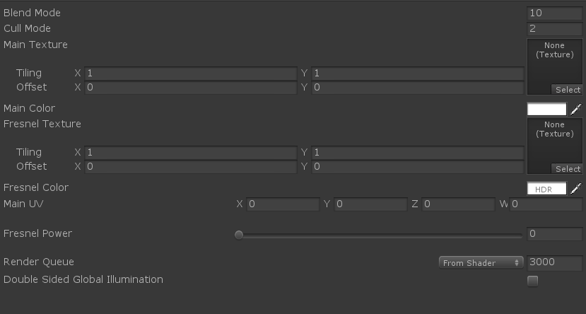
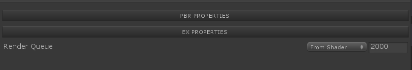

本文是Shader基础篇的第九篇，主要讨论下Shader的自定义面板。

## 介绍

### 何为自定义面板呢？

自定义面板就是使用者能够自己定制材质球的Inspector页面

###  为什么要用自定义面板呢？

使用自定义面板能够打造可控的、精美布局的页面，方便使用者高效的使用Shader

看下两者的区别

​																	Unity默认材质面板



​											                   自定义面板  


​																	自定义可折叠面板



## 自定义材质面板方式

1.Shader中直接定义（直接网上找的例子，这种方法实现有点局限，能玩的花样不太多）

```ShaderLab
Shader "Basic/MaterialPropertyExample"
{
    Properties
    {
        // Header creates a header text before the shader property.
        [Header(Material Property Drawer Example)]
        // Space creates vertical space before the shader property.
        [Space]
        _MainTex ("Main Tex", 2D) = "white" {}
        _SecondTex ("Second Tex", 2D) = "white" {}
        
        // Large amount of space
        [Space(50)]

        // Toggle displays a **float** as a toggle. 
        // The property value will be 0 or 1, depending on the toggle state. 
        // When it is on, a shader keyword with the uppercase property name +"_ON" will be set, 
        // or an explicitly specified shader keyword.
        [Toggle] _Invert ("Invert color?", Float) = 0

        // Will set "ENABLE_FANCY" shader keyword when set
        [Toggle(ENABLE_FANCY)] _Fancy ("Fancy?", Float) = 0

        // Enum displays a popup menu for a **float** property. 
        // You can supply either an enum type name 
        // (preferably fully qualified with namespaces, in case there are multiple types), 
        // or explicit name/value pairs to display. 
        // Up to **7** name/value pairs can be specified
        [Enum(UnityEngine.Rendering.BlendMode)] _SrcBlend ("Src Blend Mode", Float) = 1
        [Enum(UnityEngine.Rendering.BlendMode)] _DstBlend ("Dst Blend Mode", Float) = 1
        [Enum(Off, 0, On, 1)] _ZWrite ("ZWrite", Float) = 0
        [Enum(UnityEngine.Rendering.CompareFunction)] _ZTest ("ZTest", Float) = 0
        [Enum(UnityEngine.Rendering.CullMode)] _Cull ("Cull Mode", Float) = 1

        // KeywordEnum displays a popup menu for a **float** property, and enables corresponding shader keyword. 
        // This is used with "#pragma multi_compile" in shaders, to enable or disable parts of shader code. 
        // Each name will enable "property name" + underscore + "enum name", uppercased, shader keyword. 
        // Up to **9** names can be provided.
        [KeywordEnum(None, Add, Multiply)] _Overlay ("Overlay mode", Float) = 0

        // PowerSlider displays a slider with a non-linear response for a Range shader property.
        // A slider with 3.0 response curve
        [PowerSlider(3.0)] _Shininess ("Shininess", Range (0.01, 1)) = 0.08
    }
    SubShader
    {
        Tags { "Queue"="Transparent" "RenderType"="Transparent" }
        Blend [_SrcBlend] [_DstBlend]
        ZWrite [_ZWrite]
        ZTest [_ZTest]
        Cull [_Cull]

        Pass
        {
            CGPROGRAM
            // Need to define _INVERT_ON shader keyword
            #pragma shader_feature _INVERT_ON
            // Need to define _INVERT_ON shader keyword
            #pragma shader_feature ENABLE_FANCY
            // No comma between features
            #pragma multi_compile _OVERLAY_NONE _OVERLAY_ADD _OVERLAY_MULTIPLY

            #pragma vertex vert
            #pragma fragment frag

            #include "UnityCG.cginc"

            sampler2D _MainTex;
            float4 _MainTex_ST;
            sampler2D _SecondTex;
            float4 _SecondTex_ST;
            float _Shininess;

            struct appdata
            {
                float4 vertex : POSITION;
                float2 uv : TEXCOORD0;
            };

            struct v2f
            {
                float4 uv : TEXCOORD0;
                float4 vertex : SV_POSITION;
            };

            v2f vert (appdata v)
            {
                v2f o;
                o.vertex = mul(UNITY_MATRIX_MVP, v.vertex);
                o.uv.xy = TRANSFORM_TEX(v.uv, _MainTex);
                o.uv.zw = TRANSFORM_TEX(v.uv, _SecondTex);
                return o;
            }

            fixed4 frag (v2f i) : SV_Target
            {
                // sample the texture
                fixed4 col = tex2D(_MainTex, i.uv.xy);

                // Use #if, #ifdef or #if defined
                #if _INVERT_ON
                col = 1 - col;
                #endif

                // Use #if, #ifdef or #if defined
                #if ENABLE_FANCY
                col.r = 0.5;
                #endif

                fixed4 secCol = tex2D(_SecondTex, i.uv.zw);

                #if _OVERLAY_ADD
                col += secCol;
                #elif _OVERLAY_MULTIPLY
                col *= secCol;
                #endif

                col *= _Shininess;

                return col;
            }
            ENDCG
        }
    }
}
```

2.脚本定义

```C#
using System;
using System.Collections;
using System.Collections.Generic;
using UnityEditor;
using UnityEngine;
using UnityEngine.Rendering;

public class ParticleInspector : ShaderGUI
{
    public enum BendMode
    {
        Normal=0,
        Add=1,
    }
    public enum MeshSides
    {
        Single,
        Double,
    }
    public enum MaskChannel
    {
        Mask_R=0,
        Mask_A=1,
    }
    MaterialEditor m_MaterialEditor;
    MaterialProperty blendMode;
    MaterialProperty sideMode;
    MaterialProperty coordinate;
    MaterialProperty maskEnbale;
    MaterialProperty mask;
    MaterialProperty maskChannel;
    List<MaterialProperty> othersProperty;

    public void FindProperties(Material material,MaterialProperty[] props)
    {
        ClearProperties();  //清空上一次状态

        blendMode = FindProperty("_SYCDstBlend", props);
        sideMode = FindProperty("_SYCCull", props);

        if (material.HasProperty("_Coordinate")) {
            coordinate = FindProperty("_Coordinate", props);
        }
        
        if(material.HasProperty("_MaskEnable"))
            maskEnbale = FindProperty("_MaskEnable", props);

        if(material.HasProperty("_MaskTex"))
            mask = FindProperty("_MaskTex", props);

        if(material.HasProperty("_Mask_sw"))
            maskChannel = FindProperty("_Mask_sw", props);

        othersProperty = new List<MaterialProperty>();
        foreach (var pro in props)
        {
            if (pro.name.Equals("_SYCDstBlend")
                || pro.name.Equals("_SYCSrcBlend")
                || pro.name.Equals("_SYCCull")
                ||pro.name.Equals("_Coordinate")
                ||pro.name.Equals("_MaskEnable")
                ||pro.name.Equals("_MaskTex")
                ||pro.name.Equals("_Mask_sw"))
            {
                //自定义面板属性，不需要保存
            }
            else
            {
                othersProperty.Add(pro);
            }
        }
    }
    private void ClearProperties()
    {
        blendMode=null;
        sideMode=null;
        coordinate=null;
        maskEnbale = null;
        mask=null;
        maskChannel=null;
    }
    public override void OnGUI(MaterialEditor materialEditor, MaterialProperty[] properties)
    {
        var material = materialEditor.target as Material;
        //从shader中找属性
        FindProperties(material,properties); // MaterialProperties can be animated so we do not cache them but fetch them every event to ensure animated values are updated correctly
        m_MaterialEditor = materialEditor;
	   //自行实现材质球面板的绘制	
        ShaderPropertiesGUI(material);

        //处理默认
        EditorGUILayout.Space();
        EditorGUILayout.Space();
        materialEditor.RenderQueueField();  //渲染队列
        materialEditor.EnableInstancingField();  //GpuInstancing
        materialEditor.DoubleSidedGIField();  //Double GI
    }
    public void ShaderPropertiesGUI(Material material)
    {
        // Use default labelWidth
        EditorGUIUtility.labelWidth = 0f;

        //混合模式
        DoBlendMode();
        //单双面
        DoMeshSides();

        //坐标系处理
        DoCoordinate();

        //恢复为默认格式
        m_MaterialEditor.SetDefaultGUIWidths();

        //处理其他节点
        foreach (var pro in othersProperty)
        {
            m_MaterialEditor.ShaderProperty(pro, pro.displayName);
        }

        //处理mask
        DoMask(material);
    }

    private void DoMask(Material material)
    {
        if (mask != null)
        {
            bool enableChange = EditorGUILayout.Toggle("Mask Enable", maskEnbale.floatValue == 1);
            if (enableChange)
            {
                material.EnableKeyword("PARTICLE_MASK_ENABLE");
                maskEnbale.floatValue = 1;

                m_MaterialEditor.ShaderProperty(mask, mask.displayName);

                if (maskChannel != null)
                {
                    var selectIndex = (MaskChannel)maskChannel.floatValue;
                    maskChannel.floatValue = EditorGUILayout.Popup("Mask Channel", (int)selectIndex, Enum.GetNames(typeof(MaskChannel)));
                }
            }
            else
            {
                maskEnbale.floatValue = 0;
                material.DisableKeyword("PARTICLE_MASK_ENABLE");
            }
        }
    }

    private void DoCoordinate()
    {
        if (coordinate != null)
        {
            m_MaterialEditor.ShaderProperty(coordinate, coordinate.displayName);
        }
    }

    private void DoMeshSides()
    {
        var cullMode = (CullMode)sideMode.floatValue;
        var selectIndex = MeshSides.Single;
        if (cullMode == CullMode.Off)
        {
            selectIndex = MeshSides.Double;
        }
        else
        {
            selectIndex = MeshSides.Single;
        }
        EditorGUI.BeginChangeCheck();
        selectIndex = (MeshSides)EditorGUILayout.Popup("Face Mode", (int)selectIndex, Enum.GetNames(typeof(MeshSides)));
        if (EditorGUI.EndChangeCheck())
        {
            //m_MaterialEditor.RegisterPropertyChangeUndo("Bend Mode");
            var targetValue = 2f;
            if (selectIndex == MeshSides.Double)
            {
                targetValue = 0;
            }
            else
            {
                targetValue = 2f;
            }
            sideMode.floatValue = targetValue;
        }
    }

    private void DoBlendMode()
    {
        var mode = (BlendMode)blendMode.floatValue;
        var selectIndex =BendMode.Normal;
        if (mode == BlendMode.One)
        {
            selectIndex = BendMode.Add;
        }
        else if (mode == BlendMode.OneMinusSrcAlpha)
        {
            selectIndex = BendMode.Normal;
        }
        else
        {
            selectIndex = BendMode.Normal;
        }

        EditorGUI.BeginChangeCheck();
        selectIndex = (BendMode)EditorGUILayout.Popup("Bend Mode", (int)selectIndex, Enum.GetNames(typeof(BendMode)));
        if (EditorGUI.EndChangeCheck())
        {
            //m_MaterialEditor.RegisterPropertyChangeUndo("Bend Mode");
            var targetValue = 10f;
            if (selectIndex ==  BendMode.Normal)
            {
                targetValue = 10f;
            }
            else if (selectIndex ==  BendMode.Add)
            {
                targetValue = 1f;
            }
            blendMode.floatValue = targetValue;
        }
    }
}

```

这种方式能够自定义很多样式的面板，具体API大家可以去官网文档中查看或者百度都行。

## 总结

本文讨论了自定义材质面板的实现方式，大家可以根据项目的需求自行实现。有什么不明白或者需要了解的，请留言。谢谢！