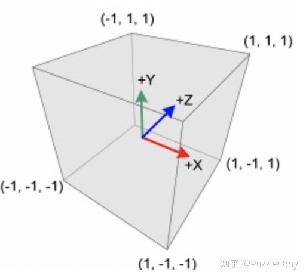
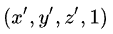
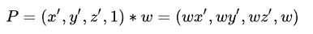

本文转自：https://zhuanlan.zhihu.com/p/65969162

很多人初次学习把剪裁空间（Clip Space）和标准化设备坐标（NDC）混淆成同一个东西，事实上它们是完全不同的。

Clip Space是一个顶点乘以MVP矩阵之后所在的空间，**Vertex Shader的输出就是在Clip Space上**（划重点），接着由GPU自己做**透视除法**将顶点转到NDC。

透视除法将Clip Space顶点的4个分量都除以w分量，就从Clip Space转换到了NDC了。

而NDC是一个长宽高取值范围为[-1,1]的立方体，超过这个范围的顶点，会被GPU剪裁。

**注**：在DirectX里面，NDC的z方向取值范围是[0,1]，在Unity中可以用`UNITY_NEAR_CLIP_VALUE`获取z方向近平面的值，在openGL环境下是-1.0，DirectX中是0.0。

我们假设在NDC中剪裁后的点的坐标为，

那x’、y'和z'的取值范围都在[-1,1]，那么反推回去Clip Space上的点就是：

其中w = -z，这个z是顶点在View Space中的z值。所以很显然，Clip Space的取值范围和NDC是不一样的。

至于为什么这整个过程是这样的，有一些图形学或数学书有讲到推导过程，如《Mathematics for 3D Game Programming and Computer Graphics》。如果不知道数学过程也没关系，只要记住**Vertex Shader的输出在Clip Space，然后GPU自己做透视除法变到了NDC（取值范围[-1,1]）**。

### Fragment Shader的输入是在什么空间？

Vertex Shader的输出在Clip Space，那Fragment Shader的输入在什么空间？不是NDC，而是**屏幕空间Screen Space**。

我们前面说到Vertex Shader的输出在Clip Space，接着GPU会做透视除法变到NDC。这之后GPU还有一步，应用视口变换，转换到Screen Space，输入给Fragment Shader：

**(Vertex Shader) => Clip Space => (透视除法) => NDC => (视口变换) => Screen Space => (Fragment Shader)**