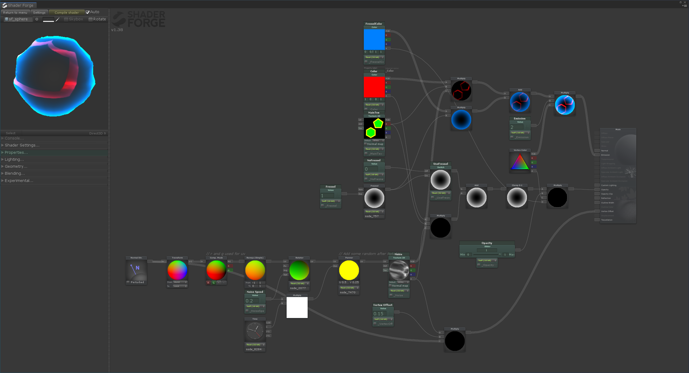
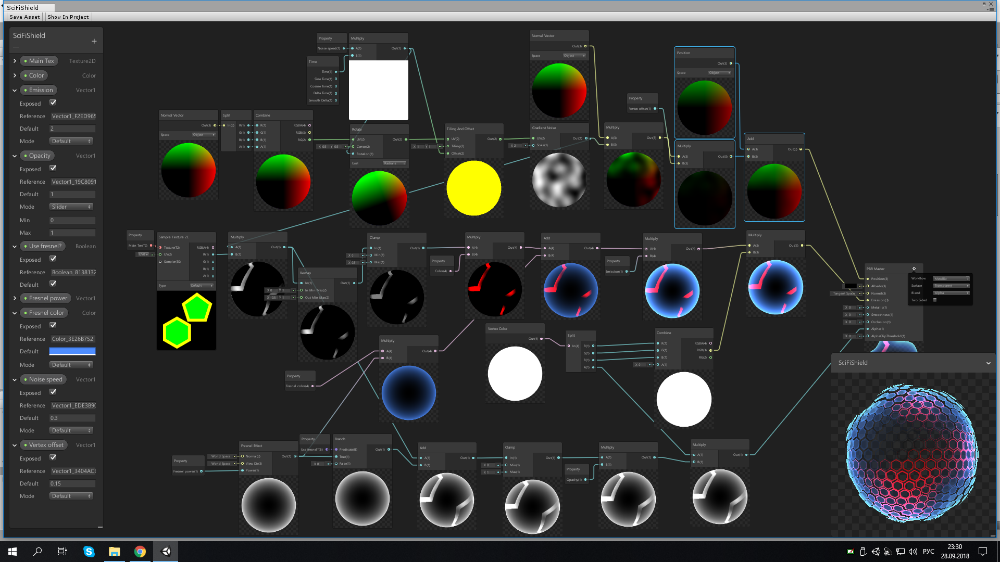
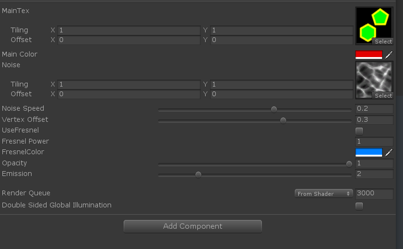

最近游戏需要一个护盾效果，于是乎在 https://www.bilibili.com/video/av65262624/上看到一个不错的效果，于是就参考这实现下。

实现后的效果大概是这样的：


具体实现过程参考视频，讲解的很清楚。

### ShaderForge实现

直接上shaderforge上实现的：



### Shader Graph上实现

直接上图了：



### Shader代码优化

当然，还有优化过的shader版本。

```ShaderLab
Shader "xxl/Effect/HuDun" {
    Properties {
        _MainTex ("MainTex", 2D) = "white" {}
		_Color ("Main Color", Color) = (1,1,1,1)
        _Noise ("Noise", 2D) = "white" {}
		_NoiseSpeed ("Noise Speed", Range(-1,1) ) = 0.2
        _VertexOffset ("Vertex Offset", Range(-1,1)) = 0.15
        [MaterialToggle] _UseFresnel ("UseFresnel", Float ) = 0
		_Fresnel ("Fresnel Power", float ) = 1
        _FresnelColor ("FresnelColor", Color) = (0,0.5,1,1)
		_Opacity ("Opacity", Range(0, 1)) = 1
        _Emission ("Emission", Range(0,10)) = 2
    }
    SubShader {
        Tags {
            "IgnoreProjector"="True"
            "Queue"="Transparent"
            "RenderType"="Transparent"
        }
        Pass {

            Blend SrcAlpha OneMinusSrcAlpha
            ZWrite Off
            
            CGPROGRAM
            #pragma vertex vert
            #pragma fragment frag
            #include "UnityCG.cginc"
            #pragma target 3.0
            sampler2D _MainTex; float4 _MainTex_ST;
            half _NoiseSpeed;
            sampler2D _Noise;  float4 _Noise_ST;
            half _VertexOffset;
            half _Fresnel;
            fixed _UseFresnel;
            float4 _Color;
            half _Opacity;
            float4 _FresnelColor;
            half _Emission;
            struct VertexInput {
                float4 vertex : POSITION;
                float3 normal : NORMAL;
                float2 texcoord0 : TEXCOORD0;
                float4 vertexColor : COLOR;
            };
            struct VertexOutput {
                float4 pos : SV_POSITION;
                float4 uv0 : TEXCOORD0;
                float4 posWorld : TEXCOORD1;
                float3 normalDir : TEXCOORD2;
                float4 vertexColor : COLOR;
            };
            VertexOutput vert (VertexInput v) {
                VertexOutput o = (VertexOutput)0;
                o.uv0.xy = v.texcoord0;
                o.vertexColor = v.vertexColor;
                o.normalDir = UnityObjectToWorldNormal(v.normal);
                float spd = _NoiseSpeed*_Time.g;
                float spdCos = cos(spd);
                float spdSin = sin(spd);
                float2 piv = float2(0.5,0.5);
             //  float2 rotator = mul((mul( unity_WorldToObject, float4(v.normal,0)).xy*0.5+0.5)-piv,float2x2( spdCos, -spdSin, spdSin, spdCos))+piv;
			    float2 rotator = mul((v.normal.xy*0.5+0.5)-piv,float2x2( spdCos, -spdSin, spdSin, spdCos))+piv;
                float2 random = (rotator+(_NoiseSpeed*_Time.g)*float2(0.5,0.25)); // Add some random after Rotator
				o.uv0.zw=random;
                float4 noiseTex = tex2Dlod(_Noise,float4(TRANSFORM_TEX(random, _Noise),0.0,0));
                v.vertex.xyz += (noiseTex.a*_VertexOffset*v.normal);
                o.posWorld = mul(unity_ObjectToWorld, v.vertex);
                o.pos = UnityObjectToClipPos( v.vertex );
                return o;
            }
            float4 frag(VertexOutput i) : COLOR {
                i.normalDir = normalize(i.normalDir);
                float3 viewDir = normalize(_WorldSpaceCameraPos.xyz - i.posWorld.xyz);
                float3 normalDir = i.normalDir;

                float4 mainTex = tex2D(_MainTex,TRANSFORM_TEX(i.uv0.xy, _MainTex));
				//float spd = _NoiseSpeed*_Time.g;
				// float spdCos = cos(spd);
				// float spdSin = sin(spd);
				// float2 piv = float2(0.5,0.5);
				// float2 rotator = mul((mul( unity_WorldToObject, float4(i.normalDir,0)).xy*0.5+0.5)-piv,float2x2( spdCos, -spdSin, spdSin, spdCos))+piv;
				// float2 random = (rotator+(_NoiseSpeed*_Time.g)*float2(0.5,0.25)); // Add some random after Rotator
				float2 random=i.uv0.zw;  //直接使用顶点着色器中计算的随机uv
                float4 noiseTex = tex2D(_Noise,TRANSFORM_TEX(random, _Noise));
                float fresnel = pow(1.0-max(0,dot(normalDir, viewDir)),_Fresnel);
                float3 finalColor = (_Color.rgb*mainTex.r*noiseTex.rgb+_FresnelColor.rgb*fresnel)*_Emission*i.vertexColor.rgb;
                float alpha=saturate(lerp(0, fresnel, _UseFresnel)+_Color.a*mainTex.r*noiseTex.a)*_Opacity*i.vertexColor.a*_FresnelColor.a;
				float4 finalRGBA = float4(finalColor,alpha);
                return finalRGBA;
            }
            ENDCG
        }
    }
}

```

shader优化主要是针对变体、计算逻辑等进行优化处理。

### Material面板预览



### 注意

1.六边形模型贴图制作参照视频，如果不会制作，后面链接送上工程，里面包含模型以及展开的贴图。

2.ShaderForge等工具生成的代码尽量优化后再在工程中使用。

### 工程源码

csdn 下载中hudun.unitypackage

https://download.csdn.net/download/a958832776/11856511

### 参考链接：

https://www.bilibili.com/video/av65262624/

https://www.youtube.com/channel/UCMqxbFCPmfH1Gf6dMIIvI4A 

[https://www.patreon.com/posts/21697148](https://www.youtube.com/redirect?redir_token=1pBIduvKB8-t5FRP_tpYieVgjoF8MTU3MDk2MDk3N0AxNTcwODc0NTc3&event=comments&q=https%3A%2F%2Fwww.patreon.com%2Fposts%2F21697148&stzid=UgwTayXpVsXQO_ztxx54AaABAg) 