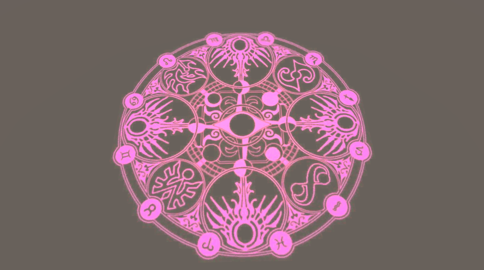
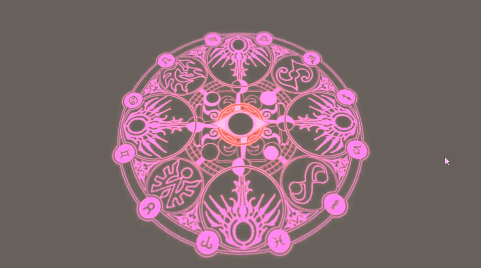

本文主要实现法阵扫光的效果，直接上实现后的效果

1.法阵贴图自身消失+扫光效果



2.法阵贴图不消失+扫光效果



具体实现细节参见代码。

### 代码

```ShaderLab
Shader "xxl/Effect/Fazhen" {
    Properties {
        _MainTex ("Base (RGB)", 2D) = "white" {}
		_FlowColor("Flow Color",Color)=(1,1,1,1)
		_Period("Period",float)=1   //周期
		_FlowWidth("Flow Width",Range(0,1))=0.1  //扫光范围
		_FlowTex("Flow Texture(RGB)",2D)="black"{} //扫光范围渐变图
		_FlowPower("Flow Light Power",Range(0,10))=1 //强度
    }
    SubShader {
        Tags {"Queue"="Transparent" "IgnoreProjector"="True" "RenderType"="Transparent"}
        Cull Off
        Lighting Off
        ZWrite Off
        Fog { Mode Off }
        Blend One One
 
        Pass {
            CGPROGRAM
            #pragma vertex vert
            #pragma fragment frag
            #include "UnityCG.cginc"
 
            sampler2D _MainTex;
			fixed4 _FlowColor;
			float _Period;
			float _FlowWidth;
			sampler2D _FlowTex;
			half _FlowPower;

            struct appdata_t {
                float4 vertex : POSITION;
                half2 texcoord : TEXCOORD0;
            };
 
            struct v2f {
                float4 pos : POSITION;
                half2 uv : TEXCOORD0;
            };
 
            v2f vert (appdata_t v)
            {
                v2f o;
                o.pos = UnityObjectToClipPos(v.vertex);
                o.uv = v.texcoord;
                return o;
            }
 
            half4 frag (v2f i) : COLOR
            {
                fixed4 baseColor = tex2D(_MainTex, i.uv);
				float2 center=float2(0.5,0.5);  //圆心   采用uv坐标进行计算
				float r=distance(i.uv,center);  //像素到圆心的距离
				float radiuMax=0.5;             //圆心到边界的最大距离 uv的范围是0到1 
				float dir=fmod(floor(_Time.y/_Period),2);   //floor相当于整除 然后跟2求余数   偶数dir=0  奇数dir=1
				float timeProgress=fmod(_Time.y,_Period)/_Period;
				float flowProgress =lerp(timeProgress,1-timeProgress,dir);
				float flowRadiusMax=flowProgress*(radiuMax+_FlowWidth); //扫光最大范围
				float flowRadiusMin=flowRadiusMax-_FlowWidth;  //扫光最小范围
				
				float condition=step(flowRadiusMin,r);
				float isInFlow=condition-step(flowRadiusMax,r);  //上面两行等价判断 flowRadiusMin <= r && r < flowRadiusMax
				float2 flowTexUV=float2((r-flowRadiusMin)/(flowRadiusMax-flowRadiusMin),0);//为了使流光边缘平滑，两边黑色，往中间白色渐变
				//half4 finalColor=baseColor*condition+isInFlow*_FlowPower*lerp(1,0,r)*tex2D(_FlowTex,flowTexUV)*_FlowColor*baseColor; 
				half4 finalColor=baseColor+isInFlow*_FlowPower*lerp(1,0,r)*tex2D(_FlowTex,flowTexUV)*_FlowColor*baseColor; //贴图本身不消失
                return finalColor;
            }
            ENDCG
        }
    } 
    FallBack "Diffuse"
}
```

参考链接中有详细的讲解。

### 工程

csdn  下载中  fazhen.unitypackage

https://download.csdn.net/download/a958832776/11856542

参考链接

https://blog.csdn.net/zzxiang1985/article/details/50706641