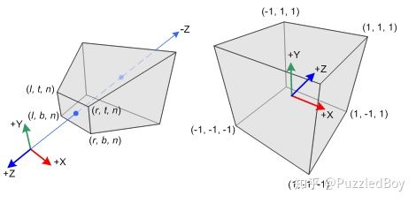
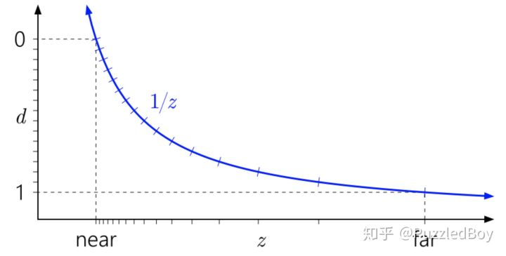
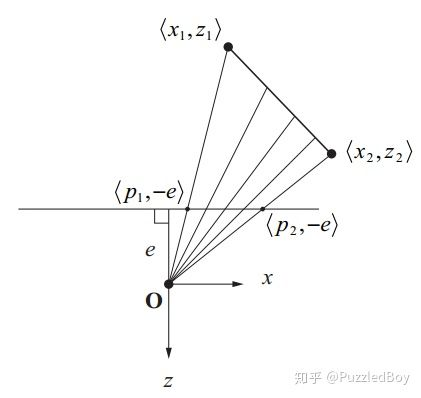
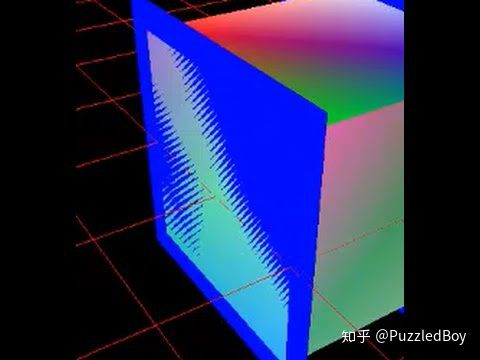
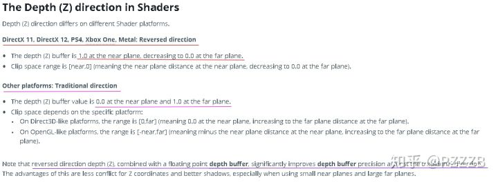
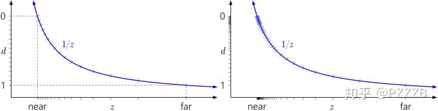
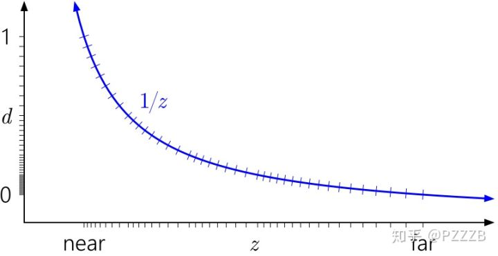

本文转自：https://zhuanlan.zhihu.com/p/66175070

## 非线性的**Depth Buffer**

我们知道顶点从View Space中转换到NDC的过程，也叫做**投影**。



​                                       视锥体将顶点从View Space变换到NDC（OpenGL）

投影过程中x和y分量都只是**分别**做了简单的线性的变化，如上图x从[l,r]线性映射到了[-1,1]，y从[b,t]到[-1,1]。
z也做了映射，但是却不是线性的！而是越靠近摄像机近平面的两个顶点，深度值相差会越大，它们的关系曲线如下：

深度缓冲d和View Space z的关系

**注**：深度值d和NDC中的z是什么关系？d就是Depth Buffer中的值，OpenGL中Depth Buffer只是将NDC的z从[-1,1]线性映射到了[0,1]而已；而D3D中，由于NDC z取值范围已经是[0,1]，所以两者是相同的。因此你大可以认为d等价于NDC z。

从图中我们可以看到距离摄像机很近的地方，占据了大半的深度取值范围。

**为什么z->d的映射是非线性的？**

实用层面的理解：计算机存储一个值是有精度的，摄像机中离我们越远的物体，信息就越少，对画面的贡献也越少，我们根本不需要为远处物体的数据提供更高的精度。所以深度值在靠近近平面精度越高，越远精度越低。

在数学上的理解：我们都知道光栅化时片段的各种属性（纹理坐标、颜色等）需要经过GPU插值，其实这个插值并不是线性的，因为在投影面上等距的两点，对应的被投影的两点并不是等距的：

投影面上等距的两点，对应的被投影的两点并不等距

如图，把线段 ![[公式]](imgs/equation.svg) ![[公式]](imgs/equation.svg) 投影到屏幕上 ![[公式]](imgs/equation.svg) 上，我们会发现在屏幕上取等距离的两点，对应线段上的点距离并不相等。然后经过数学推导发现，顶点属性的插值不和z成线性关系，而是和1/z成线性关系! 这样就和为什么深度不是线性的产生了联系。

**扩展：**如果想彻底了解投影的数学过程，可以参考一些图形学数学书或[OpenGL Projection Matrix](https://link.zhihu.com/?target=http%3A//www.songho.ca/opengl/gl_projectionmatrix.html)

作为工程师，不用记住数学，只要记住Depth Buffer是非线性的就行了。

所以在Fragment Shader中操作Depth Buffer的时候，比如制作雾效、深度可视化等，一定先将z变换到线性空间。公式参考如下：

![[公式]](imgs/equation-1572081298008.svg)

其中 ![[公式]](imgs/equation-1572081298027.svg)

其中**d**表示片段在**Depth Buffer中深度值**,**n**表示摄像机的**近平面near**,**f**表示摄像机的**远平面far**。这个公式是从投影矩阵中推导出来的，如果对数学有兴趣可以参考前面的扩展链接。

在Shaderlab中可以用内置Linear01Depth函数做深度的线性化：

```text
float Linear01Depth( float z )
```


## **深度冲突(Z-Fighting 、Depth-Fighting)**

前面提到了**Depth Buffer**是非线性的，越靠近摄像机的地方，精度越高。

因此在远离摄像机的地方，精度不够了，就容易出现两个深度值很接近的片段不断闪烁的问题，看上去就像它们在争夺谁显示在前面的权利。



解决的思路分为三种，一是可以增加深度的精度，二是杜绝物体Z过于接近的情况，三是在Shader中利用Offset语法。

第一种方法可以通过增大深度缓冲本身的数据位数来做到，但是一般来说不会这么做，因为为了解决深度冲突而增大显存的占用并不是很明智。还有一种方法就是修改摄像机的近远平面，让其范围更小，范围小了之后数据能够表示的精度自然就上升了。

第二种方法其实是很实用的，略微在场景中移动物体坐标，错开那些靠的很近的物体，其实基本上都能解决问题。

第三种，利用Offset语法，以Shaderlab为例，Offset指定片段深度的偏移量来解决这个问题：

```text
Offset Factor, Units
```

片段深度的偏移量`offset = m * factor + r * units` 其中m是多边形在深度方向的斜率的最大值，r是深度缓冲中可以分辨的差异最小值，是一个常数。


## **平台差异**

在实际项目中，你可能遇到这样的情况，在iOS和PC上是没有问题的，但是打包到Android后却出现了片段闪烁问题，疑似深度冲突，但是又因为平台差异让你不太确信。 其实你的猜测8成是对的，就是深度冲突问题，但为什么只有Android才会呢？这就要从深度缓冲的取值范围变化历史说起了。 我们现在知道，OpenGL的深度范围是[-1,1]，DirectX是[0,1]，但其实这只是早期的说法，现在已经不准确了。在Unity的这一篇[文章](https://link.zhihu.com/?target=https%3A//docs.unity3d.com/Manual/SL-PlatformDifferences.html)中，提到了这样一段话：



总结一下：

对于DirectX 11，DirectX12，PS4，Xbox One，和Metal，现在使用的都是新的方法Reversed direction。即NDC的取值范围是[1,0]。对于其他的图形接口，保持传统的取值范围。即我们前文提到的，OpenGL是[-1,1],DirectX是[0,1] (在文档中提到都是[0,1]我认为这里是文档错误。

在最后一段特别提到了，新的方法Reversed direction比旧的方法精度更高。这也是为什么在PC（DirectX11 或12）或iOS（Metal）不会出现深度冲突，但是打包在Android（OpenGL ES）确出现的原因。

**为啥取值范围从[0,1]变成[1,0]精度就更高了？**

你或许对Unity文档最后的那段话感到好奇，为什么单纯反一下取值范围精度就更高了呢？其实在Nvidia[这一篇](https://link.zhihu.com/?target=https%3A//developer.nvidia.com/content/depth-precision-visualized) 文章中有解释到原因。大意就是，我们之前认为在距离d上数值的分布应该是等距的，但其实这不对，因为计算机存储浮点数是按照 尾数^指数 的方式存储的，数值是离散的而且不等距：

左（不考虑浮点数存储格式），右（考虑浮点数存储格式）

注意看y轴上点的分布，这也导致了在实际情况下，精度的衰减其实更快，在稍微远离近平面不远的地方或许精度就不够用了。但是如果我们把y轴范围反一下，即Reversed direction，就会变成这样：



精度衰减的没那么快了，而且基本上是相同精度。因此新的接口都使用Reversed direction的方法，不过可惜OpenGL ES的取值仍然是传统取值（Android说你呢！），因此才有Unity文档中的那么一说。