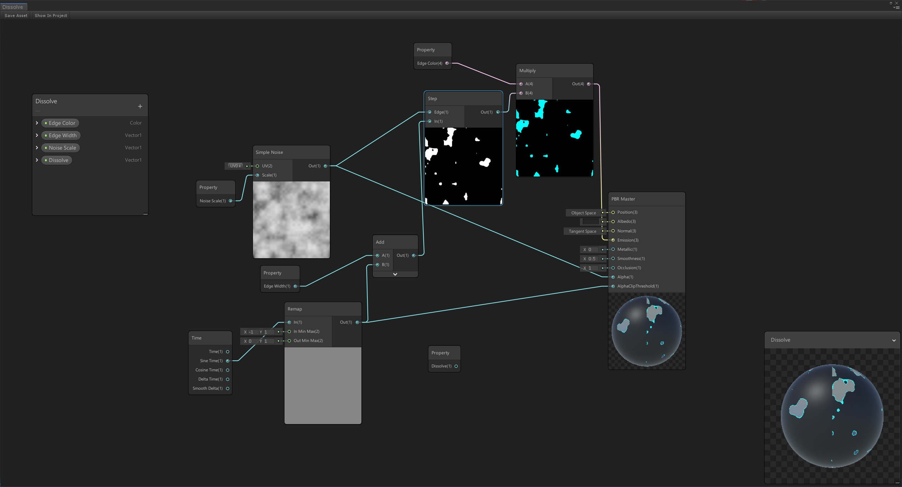

看到大神用shader graph实现了溶解效果（https://www.bilibili.com/video/av29554105/），感觉很棒，于是乎按照教程实现了一遍。

最后实现的效果


### ShaderGraph实现



其实原理很简单，SinTime提供AlphaClipThreshold，通过SimpleNoise提供Alpha，然后Clip(Alpha - AlphaClipThreshold)实现溶解效果，通过step函数来实现 边界颜色。

但是这是通过ShaderGraph实现的，在实际项目中并不希望直接使用，于是就有了下面的优化了。

### Shader优化

直接上优化过的代码了，详细解释参考注释。

```ShaderLab
Shader "xxl/Effect/RongJie"
{
    Properties
    {
		_MainTex("Main Texture",2D)="white"{}
        _EdgeColor("Edge Color",Color)=(0,5.145098,16,0)
		_EdgeWidth("Edge Width",Float)=0.01
		_NoiseScale("Noise Scale",Float)=30
		//_Dissolve("Dissolve",Range(0,1))=0
		_Perirod("Perirod(s)",float)=1 //周期
		_StartDis("Start Dissolve",Range(0,1))=0  //溶解起始
		_EndDis("End Dissolve",Range(0,1))=1  //溶解结束
    }
    SubShader
    {
        Tags { "RenderType"="Opaque" }

        Pass
        {
            CGPROGRAM
            #pragma vertex vert
            #pragma fragment frag

            #include "UnityCG.cginc"

            struct appdata
            {
                float4 vertex : POSITION;
                float2 texcoord0 : TEXCOORD0;
				UNITY_VERTEX_INPUT_INSTANCE_ID
            };

            struct v2f
            {
				float4 vertex : SV_POSITION;
                float2 uv0 : TEXCOORD0;
				
                UNITY_VERTEX_INPUT_INSTANCE_ID
            	UNITY_VERTEX_OUTPUT_STEREO
            };
			sampler2D _MainTex;
			float4 _MainTex_ST;
			float4 _EdgeColor;
			half _EdgeWidth;
			half _NoiseScale;
			//half _Dissolve;
			half _Perirod;
			fixed _StartDis;
			fixed _EndDis;

			inline float unity_noise_randomValue(float2 uv)
			{
				return frac(sin(dot(uv,float2(12.9898,78.233)))*43758.5453);
			}

			inline float unity_valueNoise(float2 uv)
			{
				float2 i=floor(uv);
				float2 f=frac(uv);
				uv=abs(f-0.5);
				f=f*f*(3.0-2.0*f);

				float2 c0=i;
				float2 c1=i+float2(1.0,0.0);
				float2 c2=i+float2(0.0,1.0);
				float2 c3=i+float2(1.0,1.0);
				float r0=unity_noise_randomValue(c0);
				float r1=unity_noise_randomValue(c1);
				float r2=unity_noise_randomValue(c2);
				float r3=unity_noise_randomValue(c3);

				float bottomOfGrid=lerp(r0,r1,f.x);
				float topOfGrid=lerp(r2,r3,f.x);
				return lerp(bottomOfGrid,topOfGrid,f.y);
			}
			inline void Unity_SimpleNoise(float2 UV,float Scale,out float Out)
			{
				float t=0.0;
				float freq=1 ;  //  1/pow(2.0, float(0));
				float amp=0.125; //pow(0.5, float(3-0));
				t+=unity_valueNoise(UV*Scale*freq)*amp;

				freq=0.5;  //  1/pow(2.0, float(1));
				amp=0.25;  // pow(0.5, float(3-1));
				t+=unity_valueNoise(UV*Scale*freq)*amp;

				freq=0.25;  //   1/pow(2.0, float(2));
				amp=0.5;   //     pow(0.5, float(3-2));
				t+=unity_valueNoise(UV*Scale*freq)*amp;

				Out=t;
			}

            v2f vert (appdata v)
            {
                v2f o=(v2f)0;
				UNITY_SETUP_INSTANCE_ID(v);
            	UNITY_TRANSFER_INSTANCE_ID(v, o);
        		UNITY_INITIALIZE_VERTEX_OUTPUT_STEREO(o);
                o.vertex = UnityObjectToClipPos(v.vertex);
                o.uv0 = v.texcoord0;
                return o;
            }

            half4 frag (v2f i) : SV_Target
            {
				UNITY_SETUP_INSTANCE_ID(i);
				//计算噪声
				float simpleNoise;
				Unity_SimpleNoise(i.uv0,_NoiseScale,simpleNoise);

				//这里只用简单的纹理贴图来实现，自己可以实现其他模式，比方说PBR流程
				half4 baseColor=tex2D(_MainTex,i.uv0);
				half3 color= baseColor.rgb;   //half3(0.15,0.15,0.15);

				//边界
				float2 InMinMax=float2(-1,1);
				float2 OutMinMax=float2(_StartDis,_EndDis);
				//把SineTime值从-1到1 转换到_StartDis到_EndDis
				float remap=OutMinMax.x+(sin((UNITY_TWO_PI/_Perirod)*_Time.y)-InMinMax.x)*(OutMinMax.y-OutMinMax.x)/(InMinMax.y-InMinMax.x);
				float edgeIn=remap+_EdgeWidth;
				float edgeOut=step(simpleNoise,edgeIn);
				float4 edge=_EdgeColor*edgeOut;
				color.rgb+=edge.rgb;

				float AlphaClipThreshold=remap;
				float Alpha=simpleNoise;
				clip(Alpha-AlphaClipThreshold);  //溶解

				return half4(color,1.0);
            }
            ENDCG
        }
    }
}

```

### 工程源码

csdn 下载中 rongjie.unitypackage

https://download.csdn.net/download/a958832776/11856628

### 参考链接

https://www.bilibili.com/video/av29554105/