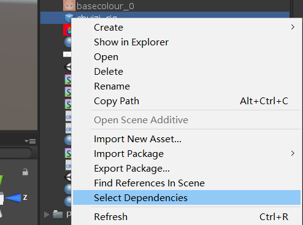
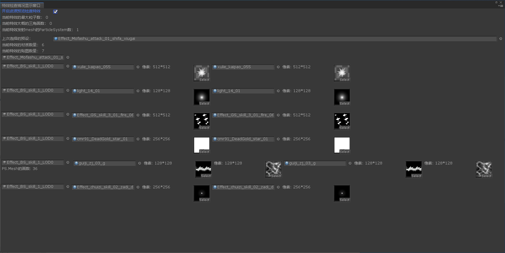
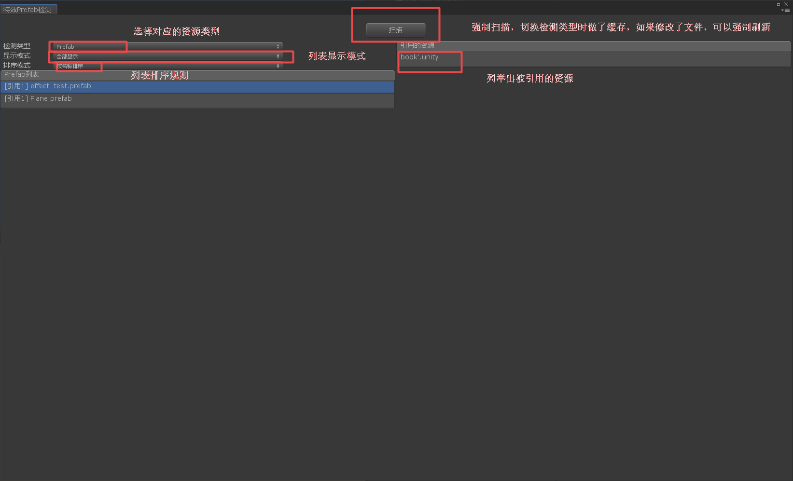
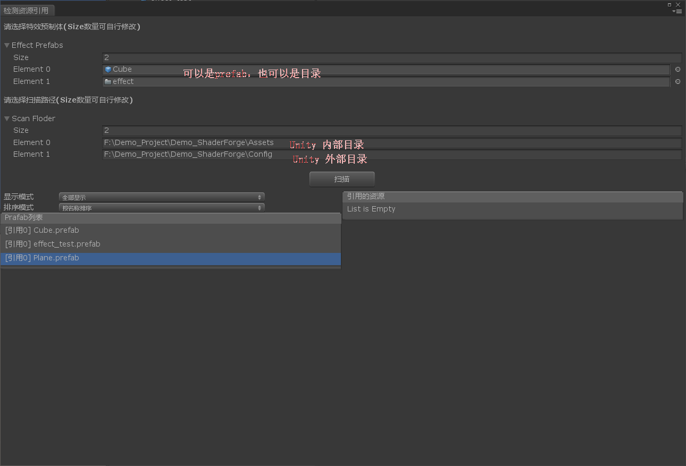

### 概述

本文主要讨论特效资源的引用问题，提供工具来分析当前特效资源。虽然说是特效资源分析，其实能适用于其他所有资源分析。具体分为两大块：**特效引用的资源**和**特效被哪些资源引用**。有点绕口，下面来具体分析。

### 特效引用资源分析

这一部分其实很好理解，就是说指定一个特效prefab，然后分析它依赖的资源即可。其实在Unity Eidtor中就有这样的功能。




这个没啥可说的，应该都知道，这里提供给分析工具方便查看。直接上图。



具体代码太长了，参见后面的链接。

### 特效被哪些资源引用

这一部分主要讲特效被哪些资源引用，其实这种情况才是常用的。比方说特效人员需要知道当前特效被哪些资源引用，然后移除掉多余的资源。

#### 1.根据Unity的依赖关系进行查找



**注意：**这里需要强调的一点是，检测类型切换的时候做了缓存，只用第一次切换时才进行扫描操作，再次切换时不再进行扫描。比方说从Prefab切换到Texture,此时触发Texture引用的第一次扫描，然后从Texture切换到Prefab，直接显示Prefab，不进行Prefab引用扫描。同理，从Prefab再切换到Texture时也使用缓存，不再扫描。

2.根据名字从脚本，配表中查找引用

这种情况使用于脚本、配表等间接的调用，在Unity中没法直接查找引用关系，只能通过文本匹配的方式等实现。



这里提供NPOI库来读取excel表，代码如下：

```
 var ex = Path.GetExtension(file).ToLower();
 bool xlsx = ex.Equals(".xlsx");
 bool xls = ex.Equals(".xls");
 if (xlsx||xls)
 {
     using (FileStream stream = File.Open(file, FileMode.Open, FileAccess.Read))
     {
         IWorkbook book = xls ? (IWorkbook)new HSSFWorkbook(stream) : (IWorkbook)new XSSFWorkbook(stream);
         for (int j = 0; j < book.NumberOfSheets; j++)
         {
             ISheet sheet = book.GetSheetAt(j);
             for (int m = 0; m < sheet.LastRowNum; m++)
             {
             var row = sheet.GetRow(m);
             for (int n = 0; n < row.LastCellNum; n++)
             {
            	 var cell = row.GetCell(n);
                 foreach (var prefabPath in assetDataset.Keys)
                 {
                	 var name = Path.GetFileNameWithoutExtension(prefabPath);
                     if (cell.CellType == CellType.String)
                     {
                         if (cell.StringCellValue.Equals(name))
                         {
                             assetDataset[prefabPath].AddAssetUser(file);  //接口做了排重处理
                         }
                     }
                 }
        	 }
         }
     }
 }
```


由于代码太长，就不在这里贴了，参考工具源码

### 工程源码

