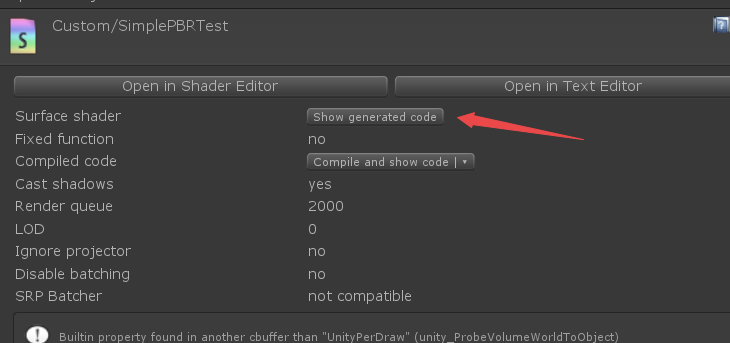

本文主要讲解如何用Unity Standard核心来快速的实现自定义PBR Shader，给大家一些简单的参考意见。

话不多说，直接上代码：

```surface shader
Shader "Custom/SimplePBRTest"
{
    Properties
    {
		_AlbedoMap("AlbedoMap", 2D) = "white" {}
		_BaseColor("BaseColor", Color) = (1,1,1,1)
		_Smooth("Smooth", Range( 0 , 1)) = 1
    }
    SubShader
    {
        Tags { "RenderType"="Opaque" }
       
        CGPROGRAM
		//StandardCustomLighting 自定义光照模型
		//noinstancing noforwardadd  为了减少surface shader 生成通道
        #pragma surface surf StandardCustomLighting fullforwardshadows  noinstancing noforwardadd    

        #pragma target 3.0
		
		//引用PBR核心库
		#include "UnityPBSLighting.cginc"
		#include "Lighting.cginc"
		
		//自定义输入结构体
		struct Input
		{
			float2 uv_texcoord;
			float3 worldNormal;
		};
		//自定义输出结构体
		struct SurfaceOutputCustomLightingCustom
		{
			half3 Albedo;
			half3 Normal;
			half3 Emission;
			half Metallic;
			half Smoothness;
			half Occlusion;
			half Alpha;
			Input SurfInput;
			UnityGIInput GIData;
		};

		float4 _BaseColor;
		sampler2D _AlbedoMap;
		float4 _AlbedoMap_ST;
		float _Smooth;

		inline half4 LightingStandardCustomLighting( inout SurfaceOutputCustomLightingCustom s, half3 viewDir, UnityGI gi )
		{
			UnityGIInput data = s.GIData;
			Input i = s.SurfInput;
			half4 c = 0;
			SurfaceOutputStandard sufaceStandard = (SurfaceOutputStandard ) 0;
			float2 uv_AlbedoMap = i.uv_texcoord * _AlbedoMap_ST.xy + _AlbedoMap_ST.zw;
			float4 mainTex = tex2D( _AlbedoMap, uv_AlbedoMap );
			sufaceStandard.Albedo = ( _BaseColor * mainTex ).rgb;
			float3 worldNormal = i.worldNormal;
			sufaceStandard.Normal = worldNormal;
			sufaceStandard.Emission = float3( 0,0,0 );
			sufaceStandard.Metallic = 0.0;   //可以自行从metallic 贴图中采样，这里简略了
			sufaceStandard.Smoothness = _Smooth;
			sufaceStandard.Occlusion = 1.0;

			data.light = gi.light;

			UnityGI customGI = gi;
			#ifdef UNITY_PASS_FORWARDBASE
			Unity_GlossyEnvironmentData g = UnityGlossyEnvironmentSetup( sufaceStandard.Smoothness, data.worldViewDir, sufaceStandard.Normal, float3(0,0,0));
			customGI = UnityGlobalIllumination( data, sufaceStandard.Occlusion, sufaceStandard.Normal, g);
			#endif

			c.rgb = LightingStandard ( sufaceStandard, viewDir, customGI ).rgb;  //Unity Standard 光照模型  PBR核心算法
			c.rbg+=sufaceStandard.Emission;  //自发光
			c.a = 1;

			return c;
		}

		inline void LightingStandardCustomLighting_GI( inout SurfaceOutputCustomLightingCustom s, UnityGIInput data, inout UnityGI gi )
		{
			s.GIData = data;
		}

        void surf (Input i, inout SurfaceOutputCustomLightingCustom o)
        {
            o.SurfInput = i;
        }
        ENDCG
    }
    FallBack "Diffuse"
}

```

通过surface shader，利用Standard 核心算法来实现PBR。

当然具体生成代码可以通过



查看。

这里只是提供一种思路，用surface shader要考虑变体的问题，不然解析起来有点费劲。