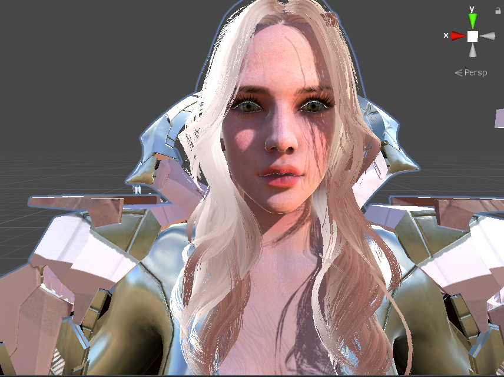
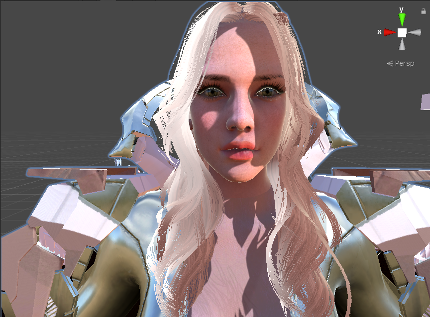

看到其他游戏中头发丝投射影子细节很炫酷，于是就捣鼓一番，按照惯例先上图。



### Unity默认的影子

Unity默认的影子是没有具体细节的，因为头发是个一堆面片，比较粗糙，效果如下：



完全沒有头发丝的感觉呢。。。

### 修改

实际上弄明白原理就很简单，头发投影时根据一张遮罩图处理了头发丝，同理投射影子时也处理下，就ok了。重新写下ShadowCaster 通道就行 。

上代码吧：

```shader
Pass
{
  ....
  	//原来通道末尾增加
  			float2 uv_OpacityMap = uv * _OpacityMap_ST.xy + _OpacityMap_ST.zw;
			float4 opacityTex = tex2D( _OpacityMap, uv_OpacityMap );
			clip( saturate(opacityTex).r - _Cutoff );  
}
Pass
	{
		Name "ShadowCaster"
		Tags{ "LightMode" = "ShadowCaster" }
		ZWrite On
		CGPROGRAM
		#pragma vertex vert
		#pragma fragment frag
		#pragma target 3.0
		#pragma multi_compile_shadowcaster
		#pragma multi_compile UNITY_PASS_SHADOWCASTER
		#pragma skip_variants FOG_LINEAR FOG_EXP FOG_EXP2
		#include "HLSLSupport.cginc"
		#include "UnityCG.cginc"

			uniform sampler2D _OpacityMap;
			uniform float4 _OpacityMap_ST;
			uniform float _Alpha;
			uniform float _Cutoff ;

		struct v2f
		{
			V2F_SHADOW_CASTER;
			float2 customPack1 : TEXCOORD1;
			UNITY_VERTEX_INPUT_INSTANCE_ID
		};
		v2f vert( appdata_full v )
		{
			v2f o;
			UNITY_SETUP_INSTANCE_ID( v );
			UNITY_INITIALIZE_OUTPUT( v2f, o );
			UNITY_TRANSFER_INSTANCE_ID( v, o );
			o.customPack1.xy = v.texcoord;
			TRANSFER_SHADOW_CASTER_NORMALOFFSET( o )
			return o;
		}
		half4 frag( v2f IN) : SV_Target
		{
			UNITY_SETUP_INSTANCE_ID( IN );
			//投射阴影增加处理
			float2 uv_OpacityMap = IN.customPack1.xy * _OpacityMap_ST.xy + _OpacityMap_ST.zw;
			float4 opacityTex = tex2D( _OpacityMap, uv_OpacityMap );
			clip( saturate(opacityTex ).r - _Cutoff );   

			SHADOW_CASTER_FRAGMENT( IN )
		}
		ENDCG
	}
```
材质设置如下（只截取关键设置部分，不明白地方留言）：


**注意：**

OpacityMap 贴图r通道记录头发丝的透明度。


