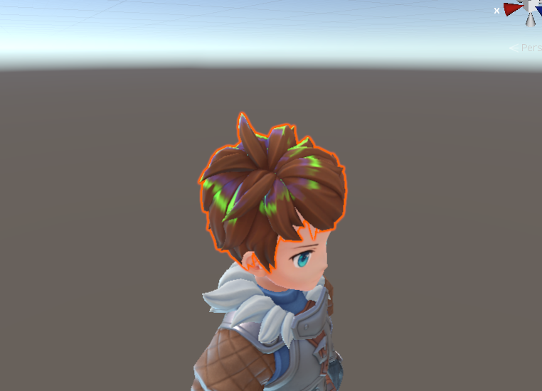
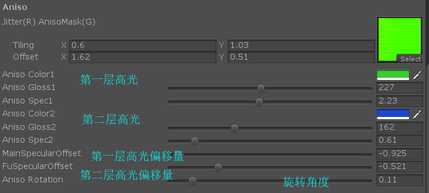

各项性异数在卡通渲染总很常见，具体核心算法参见附录中的链接，讲的很清楚，就不再啰嗦一遍了。老规矩先上图



分为两层高光来实现，用jittermap来进行抖动。

废话不多说，直接上代码：

```shader
///////////////////////////////////////////////////////////////////////
//  RotationMatrix   绕着某个轴旋转多少度
//
//  Constructs an arbitrary axis rotation matrix

inline float3x3 RotationMatrix(float3 vAxis, float fAngle)
{
    // compute sin/cos of fAngle
    float2 vSinCos;
    #ifdef OPENGL
    vSinCos.x = sin(fAngle);
    vSinCos.y = cos(fAngle);
    #else
    sincos(fAngle, vSinCos.x, vSinCos.y);
    #endif

    const float c = vSinCos.y;
    const float s = vSinCos.x;
    const float t = 1.0 - c;
    const float x = vAxis.x;
    const float y = vAxis.y;
    const float z = vAxis.z;

    return float3x3(t * x * x + c,      t * x * y - s * z,  t * x * z + s * y,
    t * x * y + s * z,  t * y * y + c,      t * y * z - s * x,
    t * x * z - s * y,  t * y * z + s * x,  t * z * z + c);
}

///////////////////////////////////////////////////////////////////////
//  mul_float3x3_float3

inline float3 mul_float3x3_float3(float3x3 mMatrix, float3 vVector)
{
	return mul(mMatrix, vVector);
}

inline half AnisoDCore2(fixed3 T, fixed3 H,half gloss ,half level)
{
    H = normalize(H);
    fixed dotTH = dot(T, H);
    fixed sinTH = sqrt(1 - dotTH * dotTH);
    fixed dirAtten = smoothstep(-1, 0, dotTH);
    return dirAtten * pow(sinTH, gloss)*level;
}	
inline half3 JitterTangent(half3 T, half3 N, float shift)
{
    half3 shiftedT = T + shift * N;
    return normalize(shiftedT);
}

inline half3 AnisoD(half smoothness, half3 normalWorld, half3 tangentWorld, half3 halfDir, half nh, half D, half2 anisoCtrl,half V,half ldotn)
{
    half jitter = anisoCtrl.r;
    //切线绕着法线旋转
    tangentWorld=mul_float3x3_float3(RotationMatrix(normalWorld,_AnisoRotation),tangentWorld);

    half3 tangentWorld1 = JitterTangent(tangentWorld, normalWorld, (jitter + _TangentShift1));
    half3 tangentWorld2 = JitterTangent(tangentWorld, normalWorld, jitter + _TangentShift2);

    half AnisoDLow = AnisoDCore2(tangentWorld1, halfDir, _AnisoGloss1,_AnisoSpec1);
    half AnisoDHigh = AnisoDCore2(tangentWorld2, halfDir, _AnisoGloss2,_AnisoSpec2); 
    half AnisoDLowTerm=AnisoDLow*V *UNITY_PI;
    AnisoDLowTerm = max(0, AnisoDLowTerm*ldotn);

    half AnisoDHighTerm=AnisoDHigh*V *UNITY_PI;
    AnisoDHighTerm= max(0, AnisoDHighTerm*ldotn);

    return (AnisoDLowTerm*_AnisoSpecColor1 + AnisoDHighTerm*_AnisoSpecColor2);
}


//具体调用（PBR  shader中调用示例）
half4 anisoMap = tex2D(_AnisoMap, TRANSFORM_TEX(uv, _AnisoMap));
half3 AnisoSpec = AnisoD(smoothness, normalDir, tangent, halfDir, hdotn, D, anisoMap.rg,V,ldotn); //用切线方向处理？ 难道不是副切线方向吗？？？

half3 finalCol = diffuse * _LightColor0.rgb
+ (FresnelTerm(specCol, ldoth)*specularTerm*(1-anisoMap.g)+AnisoSpec*anisoMap.g) *      _LightColor0.rgb*atten     //各项异性贴图b通道为遮罩
+ diffCol * giDiffuse*occlusion
+ FresnelLerp(specCol, grazingTerm, vdotn)*surfaceReduction*giSpecular*occlusion;
				
```
材质相关设置参数：



### 附录

参考链接

http://web.engr.oregonstate.edu/~mjb/cs519/Projects/Papers/HairRendering.pdf